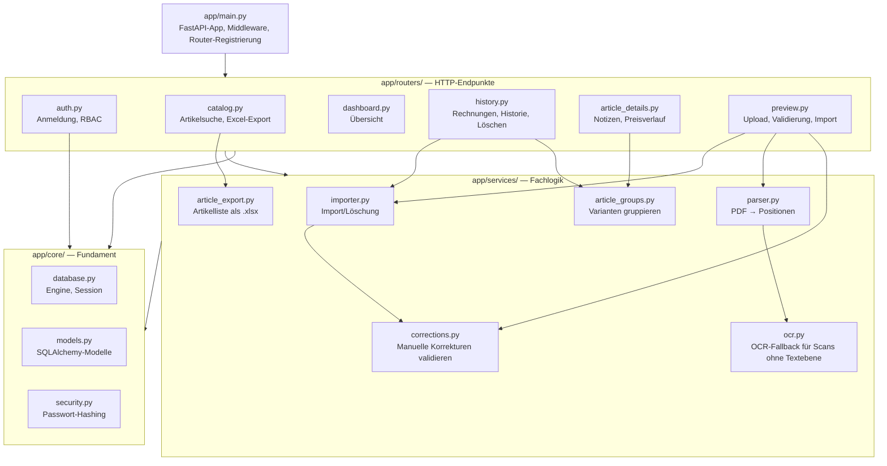
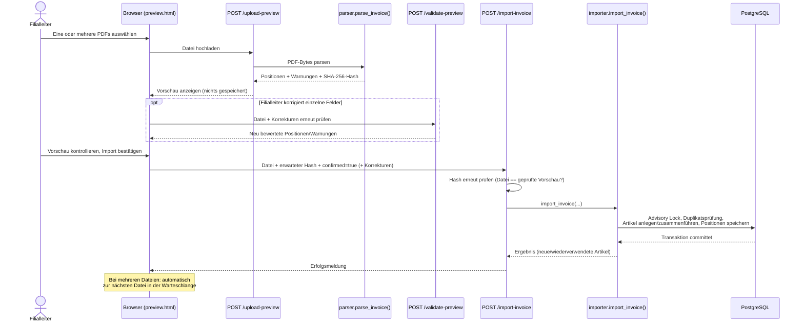

# Architektur

## Schichtenmodell

Der Code unter `app/` ist in drei Schichten gegliedert (siehe auch
`README.md`):

Faustregel: HTTP-Endpunkte gehören nach `routers/`, wiederverwendbare
Fachlogik ohne direkten HTTP-Bezug nach `services/`, alles rund um
Datenbank/Modelle/Sicherheit nach `core/`.

## Sicherheitsmodell (Anmeldung & Rechte)

Anmeldung läuft über ein signiertes Session-Cookie (`SessionMiddleware`,
`itsdangerous`), das bis zur manuellen Abmeldung gültig bleibt. Vier
FastAPI-Dependencies in `app/routers/auth.py` setzen die Zugriffsregeln
konsequent auf jedem Endpunkt durch:

| Dependency | Für | Verhalten ohne gültige Anmeldung | Verhalten ohne Filialleiter-/Admin-Rolle |
|---|---|---|---|
| `require_login_page` | Seiten (HTML) | Redirect zu `/login?next=…` | — |
| `require_login_api` | JSON-Endpunkte | HTTP 401 | — |
| `require_chef_page` | Seiten, Dokumente hochladen/bearbeiten/löschen | Redirect zu `/login?next=…` | Redirect zu `/` |
| `require_chef_api` | JSON-Endpunkte, Dokumente hochladen/bearbeiten/löschen | HTTP 401 | HTTP 403 |

(Intern heisst die Rolle weiterhin `chef` — Datenbankwert, Funktionsnamen und
CLI-Befehl `add-chef` sind unverändert; nur die Oberfläche zeigt dafür
„Filialleiter" an. `require_chef_page`/`require_chef_api` lassen zusätzlich
die Rolle `admin` durch, siehe `app/routers/auth.py`.)

Rollen und ihre Rechte (Regel 9):

| Rolle | Anmeldung | Ansehen/Suchen | Notizen | Dokumente hochladen/löschen | Filialzugriff |
|---|---|---|---|---|---|
| Mitarbeiter | Kassennummer | ✅ | nur eigene bearbeiten/löschen | ❌ | eine oder mehrere zugewiesene Filialen |
| Filialleiter (`chef`) | Kassennummer + Passwort | ✅ | alle bearbeiten/löschen | ✅ | eine oder mehrere zugewiesene Filialen |
| Admin/Zentrale (`admin`) | Kassennummer + Passwort | ✅ | alle bearbeiten/löschen | ✅ | filialübergreifend (alle Filialen + „Alle Filialen") |

Passwörter werden mit PBKDF2-HMAC-SHA256 (600'000 Iterationen, zufälliges
Salt je Konto) gehasht — siehe `app/core/security.py`. Es existiert kein
Klartext-Passwort in der Datenbank.

### Filialzuordnung und Filialwechsel

Welche Filiale(n) ein Benutzer sehen/bedienen darf, liegt in der m:n-Tabelle
`benutzer_lagerorte` (`app/core/models.py`, `app/services/lagerorte.py`) —
nicht in der `users`-Tabelle selbst, da ein Benutzer (z. B. eine Aushilfe)
mehreren Filialen zugeordnet sein kann. `ist_primaer` markiert die nach dem
Login vorausgewählte Filiale. Admin-Konten haben keinen Eintrag und gelten
als filialübergreifend.

Die aktuell aktive Filiale liegt in der Session (`active_lagerort_id`) und
wird über `POST /api/active-lagerort` gewechselt — die Auswahl dafür zeigt
`GET /api/me` (`lagerort` = aktiv, `lagerorte` = wählbar). Die Oberfläche
rendert dafür ein `<select>` in der Session-Leiste
(`app/static/js/session.js`), sichtbar sobald mehr als eine Filiale zur Wahl
steht oder der Benutzer Admin ist (dann zusätzlich „Alle Filialen“, also
kein aktiver Lagerort). Serverseitig wird bei jedem Wechsel geprüft, dass
die Ziel-Filiale dem Benutzer tatsächlich zugewiesen ist (sonst HTTP 403).
Bestand, Wareneingänge und Reduktionen sind noch nicht an die aktive Filiale
angebunden — das folgt mit dem neuen Datenmodell in den Phasen B–D.

Der `next`-Parameter beim Login (`/login?next=/artikel/...`) wird im Browser
gegen eine feste Whitelist bekannter Routen geprüft
(`app/static/js/login-redirect.js`), bevor er als Weiterleitungsziel genutzt
wird — ein manipulierter Link kann so nicht auf eine externe Seite
umleiten (offener Redirect).

## Ablauf: Rechnung hochladen und importieren

Wichtige Absicherungen in diesem Ablauf: `/upload-preview` schreibt nichts
in die Datenbank; der Import verlangt zwingend den Hash der geprüften
Datei; eine `pg_advisory_xact_lock`-Sperre serialisiert gleichzeitige
Importe/Löschungen über alle vier PCs hinweg, damit `first_seen`/`last_seen`
eines Artikels nie inkonsistent werden; bei einem Datenbankfehler wird die
gesamte Transaktion zurückgerollt (kein Teilimport); der Import bleibt
gesperrt, solange irgendeine Warnung offen ist — das gilt serverseitig,
nicht nur als Browser-Prüfung.

## Korrekturen in der Vorschau

Erkennt der Parser eine Position falsch oder unvollständig (z. B. Farbe und
Grösse nicht eindeutig getrennt, EAN fehlt), kann der Filialleiter das
betroffene Feld direkt in der Vorschau-Tabelle korrigieren, statt die ganze
Rechnung abzulehnen. `app/services/corrections.py` wendet diese Korrekturen
serverseitig auf die frisch geparsten Daten an (nie auf clientseitig
mitgeschickte Rohdaten) und validiert jede Position komplett neu:
Pflichtfelder, EAN-Format (8/12/13/14 Ziffern), Zahlenformat für Menge/UVP.
Jede tatsächliche Änderung wird als `correction_audit`
(Ausgangswert, neuer Wert, wer, wann) in `invoice_item_sources` gespeichert
— nachvollziehbar, auch nachdem die Rechnung importiert wurde. `/validate-preview`
lässt eine Korrektur vor dem eigentlichen Import gegenprüfen;
`/import-invoice` wendet dieselbe Validierung noch einmal serverseitig an,
bevor irgendetwas gespeichert wird.

## Stapel-Import (mehrere Rechnungen nacheinander)

Die Upload-Seite akzeptiert mehrere PDFs gleichzeitig. Jede Datei bekommt
einen eigenen Warteschlangen-Eintrag mit Status (wartend, bereit, Duplikat,
Fehler, importiert); der Browser prüft neue Dateien automatisch per
`/invoice-import-status` auf bereits importierte Duplikate, bevor sie in die
Warteschlange aufgenommen werden, und springt nach jedem erfolgreichen
Import selbstständig zur nächsten offenen Datei. Korrekturen an einer Datei
sind vollständig von den anderen Dateien in der Warteschlange isoliert.
Serverseitig gibt es keinen eigenen „Batch"-Endpunkt: jede Datei durchläuft
einzeln denselben Vorschau-/Validierungs-/Import-Ablauf wie ein Einzel-Upload
— die Warteschlange ist reine Frontend-Logik (`app/static/js/preview.js`).

## Artikelgruppierung, Notizen und Preisverlauf

Verschiedene Farben/Grössen eines Artikels haben unterschiedliche EANs und
damit unterschiedliche `varianten`-Datensätze. Seit dem neuen Datenmodell
(Phase A Punkt 3, siehe `datenmodell.md`) ist die Gruppierung eine echte
Fremdschlüsselbeziehung: alle Varianten eines Modells teilen sich dieselbe
`artikel_id`. `app/services/article_groups.py` liest diese Beziehung nur noch
aus, statt sie zur Laufzeit über Marke + Lieferanten-Artikelnummer
nachzubilden — die Gruppierungsregel selbst (gleiche Marke **und** gleiche,
nicht-leere Lieferanten-Artikelnummer; fehlt sie, bleibt der Artikel allein)
gilt unverändert und wird jetzt beim Import (`app/services/importer.py`)
angewendet. So zeigt die Artikeldetailseite (`/articles/{id}/history`)
automatisch die Lieferhistorie, den Preisverlauf und die Notizen aller
Varianten eines Artikels an einem Ort, ohne dass jemand die Gruppierung
manuell pflegen muss.

Notizen (`article_notes`, siehe `datenmodell.md`) sind Freitext zu einer
Artikelgruppe, z. B. Beobachtungen zum Verkauf oder Hinweise für die nächste
Bestellung. Bearbeiten/Löschen verlangt die zuletzt gelesene `version`
(optimistisches Sperren): Hat eine andere Person die Notiz inzwischen
geändert, schlägt die Anfrage mit HTTP 409 fehl, statt die fremde Änderung
stillschweigend zu überschreiben. Mitarbeiter dürfen nur eigene Notizen
bearbeiten/löschen, Filialleiter und Admin/Zentrale alle
(`_may_edit_any_note()` in `app/routers/article_details.py`).

## Artikelliste als Excel-Export

`/api/articles/export` liefert dieselbe gefilterte/sortierte Artikelliste wie
`/api/articles`, aber ohne Paginierung und als fertig formatierte `.xlsx`-Datei
(`app/services/article_export.py`, via `openpyxl`): fette Kopfzeile,
sinnvolle Spaltenbreiten, Zahlen-/Datumsformate, eingefrorene Kopfzeile und
Auto-Filter. Gedacht zum Weitergeben/Ausdrucken ausserhalb der App, z. B. für
eine Bestellliste.

## Ablauf: Rechnung löschen

Nur Filialleiter und Admin/Zentrale (`require_chef_api`). `delete_invoice()` läuft unter
derselben Advisory Lock wie der Import, entfernt die Rechnung samt
Positionen und Original-Snapshots und berechnet `first_seen`/`last_seen` der
betroffenen Artikel anschliessend aus den verbleibenden Lieferungen neu,
statt veraltete Werte stehen zu lassen.

## PDF-Parsing

`app/services/parser.py` liest die INTERSPORT-Rechnungstabelle über
Wortkoordinaten aus PyMuPDF aus (kein Layout-Template, keine feste
Spaltenbreite): Kopfzeile wird anhand bekannter Spaltentitel gesucht, Zeilen
werden anhand ihrer vertikalen Position gruppiert, Fortsetzungszeilen einer
Position (z. B. mehrzeilige Bezeichnung, Farbe/Grösse in Klammern) werden
der vorherigen Position zugeordnet. Der Parser selbst schreibt nichts in die
Datenbank und trifft keine automatischen Annahmen bei Unklarheiten — jede
unsichere Zeile bekommt eine Warnung, die den Import blockiert, bis sie
manuell geprüft (oder korrigiert, siehe oben) wurde. Ein unbekanntes
Rechnungslayout (fehlender Tabellenkopf) führt zu einem expliziten Fehler
statt zu stillem Fehlverhalten.

## OCR-Fallback für gescannte Papierrechnungen

Ganz selten kommt eine Rechnung nicht digital per Mail, sondern nur als
Papier im Paket. Ein Scan davon ist eine PDF ohne Textebene (reines
Rasterbild je Seite) und würde beim normalen Parsing sofort mit
„Tabellenkopf fehlt" scheitern. `parser.page_content()` prüft deshalb je
Seite zuerst `page.get_text("words")`; liefert das nichts, übernimmt
`app/services/ocr.py` die Seite:

1. Seite mit PyMuPDF als Bild rendern (300 DPI); Tesseracts
   Ausrichtungserkennung (OSD) korrigiert eine noch falsche Drehung, falls
   der Scan sie nicht schon selbst im PDF vermerkt hat.
2. Tesseract liest Wörter samt Positionen aus dem Bild.
3. Die Pixel-Koordinaten werden in PDF-Punkte umgerechnet und je
   erkannter Textzeile auf eine gemeinsame Höhe normalisiert, sodass das
   Ergebnis exakt wie PyMuPDFs eigene `words`-Liste aussieht — die
   bestehende Tabellenerkennung in `parser.py` (Kopfzeilensuche,
   Spaltengrenzen, Zeilengruppierung) läuft danach unverändert weiter,
   ganz gleich ob die Wörter aus der Textebene oder per OCR stammen.

OCR-Seiten und die daraus gelesenen Positionen werden mit `ocr_used`
markiert (bis in die Datenbank, `Invoice.ocr_used`); die Vorschau zeigt
dafür einen eigenen Hinweis, der zu besonders sorgfältiger Kontrolle rät,
blockiert den Import über diese Markierung allein aber nicht — nur
echte Datenprobleme (fehlende Pflichtfelder, uneindeutige Farbe/Grösse
usw.) tun das, genau wie bei digital erhaltenen Rechnungen. Ist
Tesseract auf dem Rechner nicht installiert, meldet der Upload einen
klaren Fehler statt eines stillen Fehlschlags (siehe `README.md` fürs
lokale Setup; im Docker-Image ist Tesseract bereits enthalten).

## Frontend: kein Framework, aber ein gemeinsames Theme

`app/static/js/` bleibt bewusst ohne Build-Pipeline (siehe Entscheidung E8),
zwei Skripte werden aber seitenübergreifend eingebunden:

- `theme.js` verwaltet Hell-/Dunkelmodus über CSS-Custom-Properties in
  `app.css` (folgt standardmässig der Systemeinstellung, manuell
  umschaltbar, per `localStorage` gemerkt) und liefert den Umschalt-Knopf
  als Factory-Funktion.
- `session.js` baut daraus auf jeder Seite mit aktiver Anmeldung die
  Kopfzeile (Name/Kassennummer, Rolle, Filial-Umschalter sofern mehr als
  eine Filiale wählbar ist, „Abmelden", Einstellungen-Menü mit dem
  Hell/Dunkel-Umschalter) und blendet für Mitarbeiter die Upload-Funktionen
  aus.

Für ältere oder sehbeeinträchtigte Mitarbeitende bietet die Artikelsuche
zusätzlich eine Spalten-Auswahl (einzelne Spalten ausblenden) und grössere
Schrift in der Ergebnistabelle, ebenfalls per `localStorage` gemerkt.

## Fehlerbehandlung

Durchgängiges Prinzip: lieber explizit fehlschlagen mit einer klaren, in der
Kontosprache übersetzten Meldung (siehe „Mehrsprachigkeit (i18n)" unten) als
eine Annahme treffen, die sich später als falsch herausstellt. Beispiele:
unbekanntes Rechnungslayout, passwortgeschützte PDFs, zu grosse Dateien
(> 20 MB), uneindeutige Farbe/Grösse-Angaben, nicht eindeutig erkanntes
Rechnungs-/Belegdatum, widersprüchliche Korrekturwerte, gleichzeitig
bearbeitete Notizen (HTTP 409). Datenbankfehler während eines Imports oder
einer Löschung führen zum vollständigen Rollback der Transaktion (nie ein
Teilimport).

## Mehrsprachigkeit (i18n)

Regel 7: Deutsch ist Standard, DE/FR/EN sind vollständig unterstützt, keine
hartcodierten UI-Texte oder Fehlermeldungen (Templates, JS **und** Backend).

**Katalog.** Einzige Quelle sind drei flache JSON-Dateien
`app/static/i18n/{de,fr,en}.json` (Key → übersetzter Text, `{platzhalter}`
per `str.format`). Sie sind direkt unter `/static/i18n/<sprache>.json`
abrufbar (fürs Frontend) und werden vom Backend über `app/core/i18n.py`
gelesen (`translate(key, language, **params)`, `template()` für den
unformatierten Text, `normalize_language()`). Ein fehlender Key fällt auf
Deutsch, dann auf den Key selbst zurück (macht einen vergessenen
Katalog-Eintrag sofort sichtbar statt einen kryptischen Fehler zu werfen).

**Spracherkennung pro Request** (`app/routers/auth.py`): eingeloggt die
Kontosprache (`users.language`, per `Depends(get_language)` — nutzt den von
`require_login_api` bereits geladenen Benutzer, keine zusätzliche
DB-Abfrage); anonym (z. B. `/login`) der `Accept-Language`-Header
(`get_language_optional`), sonst Deutsch. Alle Router, die Fehler werfen,
hängen `language: str = Depends(get_language)` an und übersetzen jede
`HTTPException`-Meldung mit `translate(key, language, ...)`. Das gilt auch
für die Service-Schicht (`parser.py`, `ocr.py`, `corrections.py`,
`importer.py`): `language` wird von den Routern bis zu `parse_invoice()`,
`apply_corrections()`, `import_invoice()`, `delete_invoice()` durchgereicht,
damit auch Parser-Warnungen (in der Vorschau angezeigt) und
Korrektur-Fehlermeldungen übersetzt sind. Eine Besonderheit:
`corrections.py` muss beim erneuten Validieren alte Parser-Warnungen
sprachunabhängig wiedererkennen (z. B. „Pflichtfeld fehlt: …" vs. „Required
field missing: …") — dafür liefert `template()` die unformatierte
Vorlage, deren fester Teil vor dem ersten `{` als Präfix dient.

**Frontend** (`app/static/js/i18n.js`, IIFE, exponiert `window.SportfabrikI18n`):
lädt beim Start den Katalog der zuletzt gewählten Sprache (`localStorage`
`sportfabrikLanguage`, vor dem Login gesetzt) und wendet ihn auf alle
Elemente mit `data-i18n`/`data-i18n-placeholder`/`data-i18n-aria-label`/
`data-i18n-title` an (`textContent` bzw. das jeweilige Attribut). Der
deutsche Text steht weiterhin direkt im HTML (Fallback vor dem ersten
Katalog-Fetch, matcht Deutsch als Standard). Dynamisch von JavaScript
erzeugter Text nutzt `window.SportfabrikI18n.t(key, vars)`; nach einem
Sprachwechsel feuert ein `sportfabrik:i18n-ready`-Event, auf das jede Seite
mit dynamischem Inhalt lauscht, um neu zu rendern (z. B. `load()` in
`history.html`/`articles.html`, `renderQueue()`/`render()` in `preview.js`).
`session.js` gleicht nach dem Login die Konto-Sprache aus `/api/me` mit
`localStorage` ab (`syncFromAccount`, kein erneutes `POST`); der
Sprach-Umschalter im Einstellungen-Menü bzw. auf der Login-Seite ruft
`setLanguage()` auf, was den Katalog neu lädt **und** (eingeloggt)
`POST /api/language` aufruft.

**Was (bewusst) nicht übersetzt wird:** Artikeldaten aus Lieferantendokumenten
(Regel 7), feste Textanker im INTERSPORT-Layout, mit denen der Parser das
PDF durchsucht (z. B. „Rechnungsdatum"/„Belegdatum" — das PDF ist immer
deutsch, unabhängig von der UI-Sprache), Pydantic-Feldvalidierungsfehler
(z. B. leere Notiz) — deren JSON-Form (`detail` als Liste statt String)
wird vom Frontend ohnehin nie direkt anzeigt, sondern durch eine generische
übersetzte Meldung ersetzt —, sowie die Spaltenüberschriften im
Excel-Export (`article_export.py`, eigenes Dokumentformat, noch offen).
