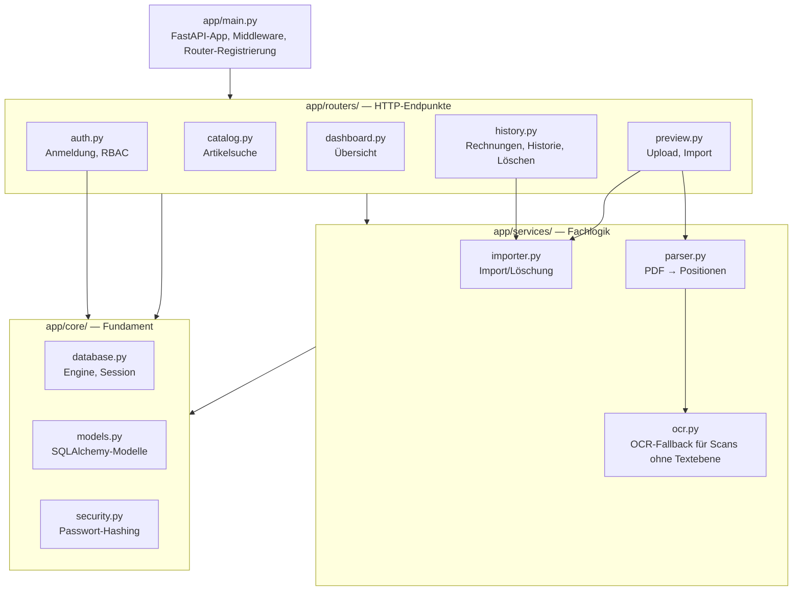
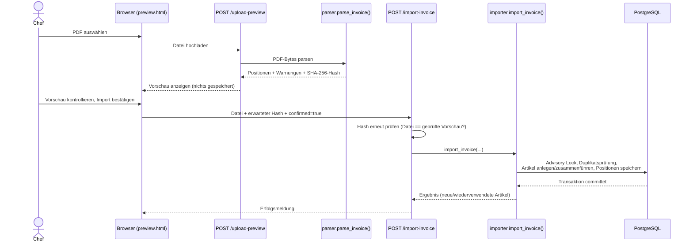

# Architektur

## Schichtenmodell

Der Code unter `app/` ist in drei Schichten gegliedert (siehe auch
`README.md`):

Faustregel: HTTP-Endpunkte gehören nach `routers/`, wiederverwendbare
Fachlogik ohne direkten HTTP-Bezug nach `services/`, alles rund um
Datenbank/Modelle/Sicherheit nach `core/`.

## Sicherheitsmodell (Anmeldung & Rechte)

Anmeldung läuft über ein signiertes Session-Cookie (`SessionMiddleware`,
`itsdangerous`), das bis zur manuellen Abmeldung gültig bleibt. Vier
FastAPI-Dependencies in `app/routers/auth.py` setzen die Zugriffsregeln
konsequent auf jedem Endpunkt durch:

| Dependency | Für | Verhalten ohne gültige Anmeldung | Verhalten ohne Chef-Rolle |
|---|---|---|---|
| `require_login_page` | Seiten (HTML) | Redirect zu `/login?next=…` | — |
| `require_login_api` | JSON-Endpunkte | HTTP 401 | — |
| `require_chef_page` | Seiten, nur Chefs | Redirect zu `/login?next=…` | Redirect zu `/` |
| `require_chef_api` | JSON-Endpunkte, nur Chefs | HTTP 401 | HTTP 403 |

Rollen und ihre Rechte:

| Rolle | Anmeldung | Ansehen/Suchen | Hochladen/Importieren | Löschen |
|---|---|---|---|---|
| Mitarbeiter | Kassennummer | ✅ | ❌ | ❌ |
| Chef | Kassennummer + Passwort | ✅ | ✅ | ✅ |

Passwörter werden mit PBKDF2-HMAC-SHA256 (600'000 Iterationen, zufälliges
Salt je Konto) gehasht — siehe `app/core/security.py`. Es existiert kein
Klartext-Passwort in der Datenbank.

## Ablauf: Rechnung hochladen und importieren

Wichtige Absicherungen in diesem Ablauf: `/upload-preview` schreibt nichts
in die Datenbank; der Import verlangt zwingend den Hash der geprüften
Datei; eine `pg_advisory_xact_lock`-Sperre serialisiert gleichzeitige
Importe/Löschungen über alle vier PCs hinweg, damit `first_seen`/`last_seen`
eines Artikels nie inkonsistent werden; bei einem Datenbankfehler wird die
gesamte Transaktion zurückgerollt (kein Teilimport).

## Ablauf: Rechnung löschen

Nur Chefs (`require_chef_api`). `delete_invoice()` läuft unter derselben
Advisory Lock wie der Import, entfernt die Rechnung samt Positionen und
Original-Snapshots und berechnet `first_seen`/`last_seen` der betroffenen
Artikel anschliessend aus den verbleibenden Lieferungen neu, statt veraltete
Werte stehen zu lassen.

## PDF-Parsing

`app/services/parser.py` liest die INTERSPORT-Rechnungstabelle über
Wortkoordinaten aus PyMuPDF aus (kein Layout-Template, keine feste
Spaltenbreite): Kopfzeile wird anhand bekannter Spaltentitel gesucht, Zeilen
werden anhand ihrer vertikalen Position gruppiert, Fortsetzungszeilen einer
Position (z. B. mehrzeilige Bezeichnung, Farbe/Grösse in Klammern) werden
der vorherigen Position zugeordnet. Der Parser selbst schreibt nichts in die
Datenbank und trifft keine automatischen Annahmen bei Unklarheiten — jede
unsichere Zeile bekommt eine Warnung, die den Import blockiert, bis sie
manuell geprüft wurde. Ein unbekanntes Rechnungslayout (fehlender
Tabellenkopf) führt zu einem expliziten Fehler statt zu stillem
Fehlverhalten.

## OCR-Fallback für gescannte Papierrechnungen

Ganz selten kommt eine Rechnung nicht digital per Mail, sondern nur als
Papier im Paket. Ein Scan davon ist eine PDF ohne Textebene (reines
Rasterbild je Seite) und würde beim normalen Parsing sofort mit
"Tabellenkopf fehlt" scheitern. `parser.page_content()` prüft deshalb je
Seite zuerst `page.get_text("words")`; liefert das nichts, übernimmt
`app/services/ocr.py` die Seite:

1. Seite mit PyMuPDF als Bild rendern (300 DPI); Tesseracts
   Ausrichtungserkennung (OSD) korrigiert eine noch falsche Drehung, falls
   der Scan sie nicht schon selbst im PDF vermerkt hat.
2. Tesseract liest Wörter samt Positionen aus dem Bild.
3. Die Pixel-Koordinaten werden in PDF-Punkte umgerechnet und je
   erkannter Textzeile auf eine gemeinsame Höhe normalisiert, sodass das
   Ergebnis exakt wie PyMuPDFs eigene `words`-Liste aussieht — die
   bestehende Tabellenerkennung in `parser.py` (Kopfzeilensuche,
   Spaltengrenzen, Zeilengruppierung) läuft danach unverändert weiter,
   ganz gleich ob die Wörter aus der Textebene oder per OCR stammen.

OCR-Seiten und die daraus gelesenen Positionen werden mit `ocr_used`
markiert (bis in die Datenbank, `Invoice.ocr_used`); die Vorschau zeigt
dafür einen eigenen Hinweis, der zu besonders sorgfältiger Kontrolle rät,
blockiert den Import über diese Markierung allein aber nicht — nur
echte Datenprobleme (fehlende Pflichtfelder, uneindeutige Farbe/Grösse
usw.) tun das, genau wie bei digital erhaltenen Rechnungen. Ist
Tesseract auf dem Rechner nicht installiert, meldet der Upload einen
klaren Fehler statt eines stillen Fehlschlags (siehe `README.md` fürs
lokale Setup; im Docker-Image ist Tesseract bereits enthalten).

## Fehlerbehandlung

Durchgängiges Prinzip: lieber explizit fehlschlagen mit einer klaren
deutschen Meldung als eine Annahme treffen, die sich später als falsch
herausstellt. Beispiele: unbekanntes Rechnungslayout, passwortgeschützte
PDFs, zu grosse Dateien (> 20 MB), uneindeutige Farbe/Grösse-Angaben, nicht
eindeutig erkanntes Rechnungs-/Belegdatum. Datenbankfehler während eines
Imports oder einer Löschung führen zum vollständigen Rollback der
Transaktion (nie ein Teilimport).
