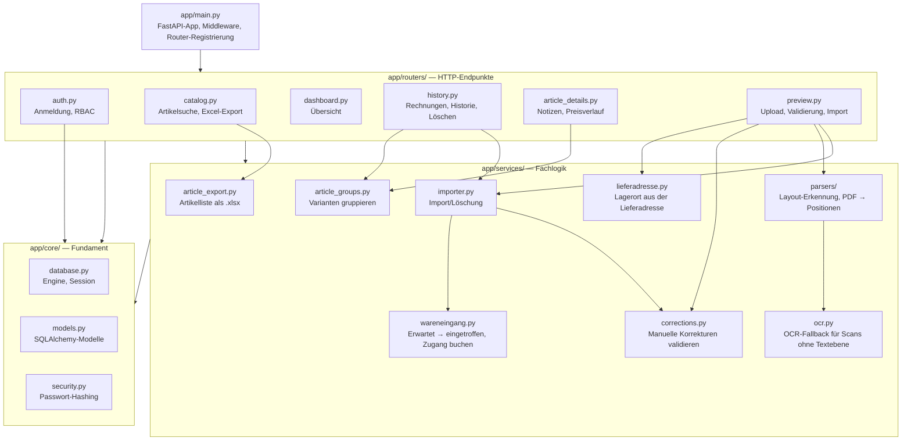
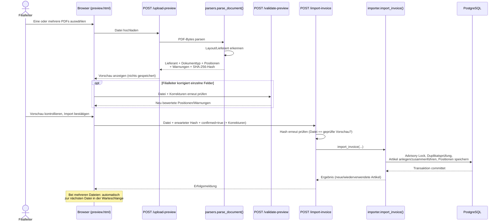

# Architektur

## Schichtenmodell

Der Code unter `app/` ist in drei Schichten gegliedert (siehe auch
`README.md`):

Faustregel: HTTP-Endpunkte gehören nach `routers/`, wiederverwendbare
Fachlogik ohne direkten HTTP-Bezug nach `services/`, alles rund um
Datenbank/Modelle/Sicherheit nach `core/`.

## Sicherheitsmodell (Anmeldung & Rechte)

Anmeldung läuft über ein signiertes Session-Cookie (`SessionMiddleware`,
`itsdangerous`), das bis zur manuellen Abmeldung gültig bleibt. Vier
FastAPI-Dependencies in `app/routers/auth.py` setzen die Zugriffsregeln
konsequent auf jedem Endpunkt durch:

| Dependency | Für | Verhalten ohne gültige Anmeldung | Verhalten ohne Filialleiter-/Admin-Rolle |
|---|---|---|---|
| `require_login_page` | Seiten (HTML) | Redirect zu `/login?next=…` | — |
| `require_login_api` | JSON-Endpunkte | HTTP 401 | — |
| `require_chef_page` | Seiten, Dokumente hochladen/bearbeiten/löschen | Redirect zu `/login?next=…` | Redirect zu `/` |
| `require_chef_api` | JSON-Endpunkte, Dokumente hochladen/bearbeiten/löschen | HTTP 401 | HTTP 403 |

(Intern heisst die Rolle weiterhin `chef` — Datenbankwert, Funktionsnamen und
CLI-Befehl `add-chef` sind unverändert; nur die Oberfläche zeigt dafür
„Filialleiter" an. `require_chef_page`/`require_chef_api` lassen zusätzlich
die Rolle `admin` durch, siehe `app/routers/auth.py`.)

Rollen und ihre Rechte (Regel 9):

| Rolle | Anmeldung | Ansehen/Suchen | Notizen | Dokumente hochladen/löschen | Filialzugriff |
|---|---|---|---|---|---|
| Mitarbeiter | Kassennummer | ✅ | nur eigene bearbeiten/löschen | ❌ | eine oder mehrere zugewiesene Filialen |
| Filialleiter (`chef`) | Kassennummer + Passwort | ✅ | alle bearbeiten/löschen | ✅ | eine oder mehrere zugewiesene Filialen |
| Admin/Zentrale (`admin`) | Kassennummer + Passwort | ✅ | alle bearbeiten/löschen | ✅ | filialübergreifend (alle Filialen + „Alle Filialen") |

Passwörter werden mit PBKDF2-HMAC-SHA256 (600'000 Iterationen, zufälliges
Salt je Konto) gehasht — siehe `app/core/security.py`. Es existiert kein
Klartext-Passwort in der Datenbank.

### Filialzuordnung und Filialwechsel

Welche Filiale(n) ein Benutzer sehen/bedienen darf, liegt in der m:n-Tabelle
`benutzer_lagerorte` (`app/core/models.py`, `app/services/lagerorte.py`) —
nicht in der `users`-Tabelle selbst, da ein Benutzer (z. B. eine Aushilfe)
mehreren Filialen zugeordnet sein kann. `ist_primaer` markiert die nach dem
Login vorausgewählte Filiale. Admin-Konten haben keinen Eintrag und gelten
als filialübergreifend.

Die aktuell aktive Filiale liegt in der Session (`active_lagerort_id`) und
wird über `POST /api/active-lagerort` gewechselt — die Auswahl dafür zeigt
`GET /api/me` (`lagerort` = aktiv, `lagerorte` = wählbar). Die Oberfläche
rendert dafür ein `<select>` in der Filial-Pille rechts in der Kopfzeile
(`app/static/js/session.js`), sichtbar sobald mehr als eine Filiale zur Wahl
steht oder der Benutzer Admin ist (dann zusätzlich „Alle Filialen“, also
kein aktiver Lagerort). Serverseitig wird bei jedem Wechsel geprüft, dass
die Ziel-Filiale dem Benutzer tatsächlich zugewiesen ist (sonst HTTP 403).
Wareneingänge und Bestand sind seit dem neuen Datenmodell (Phase A Punkt 3)
an die aktive Filiale angebunden: ein Import bucht gegen die beim Upload
aktive Filiale des hochladenden Kontos (`require_active_lagerort` in
`app/routers/auth.py`); ohne gewählte Filiale (nur für Admin möglich, „Alle
Filialen") schlägt der Import mit HTTP 400 fehl. Reduktionsstufen (18-/36-
Monats-Hinweise je Filiale) folgen erst in Phase D.

Der `next`-Parameter beim Login (`/login?next=/artikel/...`) wird im Browser
gegen eine feste Whitelist bekannter Routen geprüft
(`app/static/js/login-redirect.js`), bevor er als Weiterleitungsziel genutzt
wird — ein manipulierter Link kann so nicht auf eine externe Seite
umleiten (offener Redirect).

## Ablauf: Rechnung hochladen und importieren

Wichtige Absicherungen in diesem Ablauf: `/upload-preview` schreibt nichts
in die Datenbank; der Import verlangt zwingend den Hash der geprüften
Datei; eine `pg_advisory_xact_lock`-Sperre serialisiert gleichzeitige
Importe/Löschungen über alle vier PCs hinweg, damit `first_seen`/`last_seen`
eines Artikels nie inkonsistent werden; bei einem Datenbankfehler wird die
gesamte Transaktion zurückgerollt (kein Teilimport); der Import bleibt
gesperrt, solange irgendeine Warnung offen ist — das gilt serverseitig,
nicht nur als Browser-Prüfung.

## Erwartet → eingetroffen

Regel 3 / D6: Eine **Auftragsbestätigung** oder **Bestellung** kündigt Ware nur
an. Der Import legt dafür einen Wareneingang mit Status `erwartet` an — ohne
Lagerbewegung, ohne Bestand, ohne Eingangsdatum. Artikel, Varianten und Preise
entstehen trotzdem, damit angekündigte Ware im Stamm auffindbar ist.
**Rechnung** und **Lieferschein** begleiten die Ware, sie buchen wie bisher
sofort (`TYPEN_MIT_WARE` in `app/services/importer.py`).

Gebucht wird beim Bestätigen der Ankunft (`app/services/wareneingang.py`):

| Eingabe | Wirkung |
|---|---|
| Menge je Position | Zugang als Lagerbewegung + Bestand (Regel 2), `menge_eingetroffen` wächst |
| Eingangsdatum | wird beim ersten Zugang gesetzt, rückwirkend möglich (D13) — in einem Lager ohne Verkauf gar nicht (Regel 6) |

Kommt weniger an als erwartet, bleibt die Restmenge offen und der Wareneingang
weiter `erwartet` (D22) — so ist fehlende Ware sichtbar; eine Nachlieferung
wird einfach nochmals bestätigt. Erst wenn keine Position mehr offen ist,
wechselt der Status auf `eingetroffen`.

Kommt **mehr** an als erwartet, wird die tatsächliche Menge gebucht — der
Bestand ist, was physisch im Laden steht — und die Antwort meldet die
betroffenen Positionen in `mehrlieferungen` (Positions-Id, erwartete Menge,
eingetroffene Menge, Differenz). Die Seite hängt daraus einen Warnsatz an die
Erfolgsmeldung. Gemessen wird am Gesamtstand der Position, nicht an der
einzelnen Buchung: über die erwartete Menge hinaus kommt man auch mit einer
Nachlieferung (bestätigt 22.09.2026, Phase C, Teilaufgabe C1).

Zwei Dinge sind bewusst gleich gehalten: Import und Ankunft buchen über
**dieselbe** Funktion (`buche_zugang`), und beide nehmen dieselbe
`pg_advisory_xact_lock`, damit sich Zugänge zwischen Arbeitsplätzen nicht
überholen. „Erste/letzte Lieferung" (`varianten.first_seen`/`last_seen`)
zählen nur angekommene Ware — eine Ankündigung ist keine Lieferung.

Bedient wird das auf der Seite **/wareneingaenge** (Navigation „Lieferungen"):
die offenen Lieferungen der aktiven Filiale, je Position erwartet / bereits da
/ offen und ein Feld für die jetzt eingetroffene Menge. Das dürfen auch
**Mitarbeiter** (D21) — Ankunft bestätigen ist Lagerarbeit, kein Dokumentrecht.

## Bestand ansehen

`app/services/bestand.py` liest, was `lagerbewegungen` gebucht hat — es
schreibt nichts (Regel 2). Eine Zeile ist eine **Variante × Lagerort** mit
Menge und ältestem Eingangsdatum; dieselbe Abfrage liefert Anzahl und
Gesamtmenge der ganzen Auswahl, damit die Seite nicht rechnen muss.

Drei Dinge sind bewusst so gebaut:

- **Alle Filialen sind lesbar** (bestätigt 22.09.2026). Vorausgewählt ist die
  aktive Filiale, wählbar sind alle Standorte — der Filialwechsel in der
  Sitzungsleiste bleibt davon unberührt, er entscheidet weiter darüber, wohin
  gebucht wird.
- **Zeilen mit Menge 0** sind ausgeblendet (`nur_vorhanden`), aber nicht
  gelöscht: ausverkaufte Ware bleibt im Stamm. Ein **negativer** Bestand wird
  dagegen immer gezeigt — er ist möglich (bestätigt 22.09.2026) und genau dann
  interessant.
- **Ware an einem Standort ohne Verkauf** (GEWA, VEBO, Dietikon) hat kein
  Eingangsdatum (Regel 6/D13). Die Seite schreibt dort keinen leeren Strich
  hin, sondern sagt, warum: das Datum kommt mit der Ankunft in einer Filiale.

Seite: **/bestand** (Navigation „Bestand"), Filter für Filiale, Suche und
„nur Zeilen mit Bestand", nachladen über `offset` (Phase C, Teilaufgabe C2).
Vorübergehend hat jede Zeile einen Knopf „−1" zum Testen des Ausbuchens
(siehe nächster Abschnitt).

## Ausbuchen

Verkauf oder Abgang von Hand (`app/services/ausbuchung.py`, Seite
`/ausbuchen`, Phase C, Teilaufgabe C3). Das Gegenstück zum Zugang: dieselbe
Sperre, dieselbe Regel 2 — jede Änderung ist eine Zeile in
`lagerbewegungen`, der Bestand wird im selben Schritt nachgeführt.

- **Ein Scan = ein Stück** (F15, 23.09.2026). Die Seite sammelt schnelle
  Scans und bucht sie der Reihe nach; nach jedem Scan ist das Feld sofort
  wieder frei.
- **Gründe** (F14): `verkauf` wird als `typ = verkauf` gebucht, alle anderen
  (`defekt`, `diebstahl`, `eigenbedarf`, `retoure`, `sonstiges: <Text>`) als
  `ausbuchung`. So bleiben Verkäufe von Schwund trennbar.
- **Zu wenig Bestand** (F9): warnen, trotzdem buchen. Ein Abgang ändert das
  Eingangsdatum nie.
- **Rückgängig**: Gegenbuchung `korrektur` mit `grund = 'storno:<id>'`,
  höchstens einmal je Ausbuchung — nichts wird gelöscht.
- Varianten **ohne EAN** (Regel 5) lassen sich nicht scannen; sie werden über
  ihre Varianten-Id ausgebucht, heute über den vorübergehenden Knopf „−1" in
  der Bestandsansicht (`grund = 'test'`).

## Umlagern

Ware von einem Lagerort an einen anderen (`app/services/umlagerung.py`,
Seite `/umlagern`, Phase C, Teilaufgabe C4). Gebucht wird **beim Empfang von
der empfangenden Filiale** (F5): eine Transaktion schreibt je Variante zwei
Zeilen `typ = umlagerung` — Abgang an der Quelle, Zugang am Ziel.

Welche Datumsregel gilt, entscheidet nur `lagerorte.verkauf`:

| Von → nach | Eingangsdatum / Uhr am Ziel |
|---|---|
| extern → Filiale | wird gesetzt (auf Wunsch rückwirkend), Uhr startet (D13) |
| Filiale → Filiale, Ziel kennt den Artikel | Ware behält ihr Datum (D17), Uhr des Ziels läuft weiter (F10) |
| Filiale → Filiale, Ziel hatte den Artikel nie | Uhr startet ab Eintreffen (F11) |
| beliebig → extern | kein Datum, keine Uhr (Regel 6) |

Startet eine Umlagerung die Uhr, steht das Datum an ihrer Zielzeile in
`lagerbewegungen.eingangsdatum`; `reduktion.letzter_wareneingang()` nimmt das
spätere Datum aus Wareneingängen und diesen Umlagerungen. Zu wenig Bestand an
der Quelle wird gemeldet, aber gebucht.

## Korrigieren

Bestand auf die gezählte Menge bringen (`app/services/korrektur.py`, Knopf
„Zählen" je Zeile in `/bestand`, Phase C, Teilaufgabe C5). Eingegeben wird,
was im Regal liegt; die Differenz rechnet der Server unter derselben Sperre
wie jeder Zugang und bucht sie als `typ = korrektur`. Stimmt der Bestand
schon, wird nichts gebucht. Gründe: Inventur/Zählung, Falsch gebucht, Ware
gefunden, Sonstiges (mit Text). Das Eingangsdatum ändert sich nie.

## Ware von Hand erfassen

Der zweite Weg, auf dem Ware ins System kommt: **ohne PDF, ohne Parser**
(`app/services/manuelle_erfassung.py`, Seite `/erfassen`). Gedacht für Ware
ohne Dokument und für Lieferanten, deren Layout noch kein Parser kennt.

D27: Ware ohne Dokument ist ein **direkter Wareneingang ohne Beleg** — es
entsteht kein Eintrag in `dokumente`, `wareneingaenge.dokument_id` bleibt leer
(Migration `a7b8c9d0e1f2`, dort auch `artikel.lieferant_id`). Gebucht wird
sofort (Regel 3: von Hand erfasst wird nur, was man in den Händen hält), über
**dieselbe** `buche_zugang()` und dieselbe Sperre wie Import und
Ankunftsbestätigung.

| Feld | Pflicht? | Bemerkung |
|---|---|---|
| Marke, Bezeichnung, Menge, UVP | ja (D23) | mehr wird nicht verlangt |
| EAN | nein (Regel 5) | bekannte EAN füllt das Formular aus, unbekannte wird übernommen |
| Farbe, Grösse | nein | zusammen mit Artikelnummer der Schlüssel ohne EAN |
| Einheit, Lieferanten-Artikelnummer, EK | nein | EK nur speichern, wenn vorhanden (Regel 10) |
| Lieferant | nein | gilt für den ganzen Wareneingang, nicht je Position |
| Eingangsdatum | nein | heute oder rückwirkend (D13); Lager ohne Verkauf bekommt keines (Regel 6) |

Artikel und Varianten werden über `app/services/artikel.py` gefunden — nach
genau derselben Regel wie beim Import: bekannte EAN → bekannte Variante, sonst
Lieferant + Artikelnummer + Farbe + Grösse. Das Modul gibt es, damit die
beiden Wege nicht auseinanderlaufen. Ohne Lieferant wird unter den Artikeln
ohne Lieferant gesucht; ein Artikel „Nike A1" mit Lieferant und einer ohne
bleiben also getrennt.

Ablauf in der Oberfläche (auf Scanner zugeschnitten): Barcode scannen →
Formular ist ausgefüllt → Menge tippen → Enter legt die Position in eine Liste
→ nächster Artikel. Erst **ein** Knopf am Ende bucht alle Positionen als einen
Wareneingang, in einer Transaktion: entweder alles oder nichts. Geprüft wird
serverseitig; der Browser prüft nur vorab, damit die Rückmeldung sofort kommt.

Erfassen dürfen auch **Mitarbeiter** (Regel 9/D21) — es entsteht kein
Dokument, also greift das Dokumentrecht nicht. Der Ziel-Lagerort läuft über
dieselbe serverseitige Prüfung wie der Import (`resolve_wareneingang_lagerort`,
D26), gebucht wird also auf jeden Lagerort, vorgewählt ist die aktive Filiale.
Jede Position hinterlässt ausserdem einen unveränderten Schnappschuss der
Eingabe in `wareneingang_positionen_quelle` (mit Benutzer und Zeitpunkt) und
die Lagerbewegung den Grund `manuelle-erfassung` — ein fester Schlüssel, kein
UI-Text.

## Interne EAN und Etikett

Regel 5/D10: Die EAN ist optional, viele Lieferanten liefern keine. Damit ein
solcher Artikel an der Kasse trotzdem scannbar wird, erzeugt das System auf
Knopfdruck (D24) eine **interne EAN-13 im GS1-Bereich 20-29**
(`app/services/ean.py`). Aufbau: `20` + zehnstellige Varianten-Id +
Prüfziffer. Das braucht keinen Zähler, ist für dieselbe Variante immer
dieselbe Nummer und trägt ihre Herkunft in sich; `varianten.ean_intern`
markiert sie.

Zwei Regeln dazu:

* Eine **bestehende EAN wird nie überschrieben** — der Artikelstamm bleibt
  (Regel 4), und eine gedruckte Nummer klebt bereits auf der Ware.
* Eine **von Hand nachgetragene** EAN wird streng geprüft, Format *und*
  Prüfziffer. Beim Import bleibt es bewusst beim Formatcheck (Teilaufgabe
  B3): dort steht die Nummer so im Lieferantendokument, hier tippt sie
  jemand, und ein Zahlendreher bliebe für immer im Stamm.

Das **Etikett** (D25) kommt als PDF in Etikettengrösse, damit der Sato CL4NX
Plus (D14) es 1:1 druckt — eine Seite je Etikett, `anzahl` wiederholt sie.
Darauf stehen Jahrgang, Lieferant, UVP und Reduktionsstufe, dazu Marke,
Bezeichnung, Farbe/Grösse und der **EAN-Strichcode**: ohne ihn bliebe genau
der Artikel unscannbar, für den die interne EAN gedacht ist.

| Angabe | Woher |
|---|---|
| Jahrgang | Jahr des letzten Wareneingangs dieses Artikels **in dieser Filiale** (Regel 6) |
| Lieferant | `artikel.lieferant_id`, leer bei von Hand erfasster Ware (D23) |
| UVP | neuester Eintrag im Preisverlauf der Variante |
| Reduktion | Vorschlag nach Regel 6 (18 Monate → 50 %, 36 → 70 %), überschreibbar — die 30 % aus D25 sind eine Entscheidung des Ladens, keine Zeitregel |
| Strichcode | EAN-13/EAN-8, UPC-12 als EAN-13 mit führender Null |

Gezeichnet wird mit PyMuPDF (ohnehin für das Lesen der Rechnungen im
Einsatz) und den im PDF eingebauten Schriften — keine zusätzliche
Abhängigkeit, kein Internet, keine Schriftinstallation auf dem Drucker
(Regel 1). Das Strichmuster rechnet `app/services/barcode.py` selbst aus;
eine EAN-14 (Umkarton) ist ITF-14 und wird deshalb nur als Zahl gedruckt,
ebenso eine Nummer mit falscher Prüfziffer — lieber kein Strichcode als
einer, den die Kasse nicht annimmt.

**Etikettengrösse:** einstellbar (`GROESSEN` in `app/services/etikett.py`),
Voreinstellung 84 × 47 mm — die Rollen im Sato CL4NX Plus (bestätigt am
23.09.2026); 50 × 30 mm und die übrigen Grössen bleiben wählbar. Die Modulbreite
des Strichcodes ist nach oben begrenzt, damit er auf grossen Etiketten nicht
masslos in die Breite gezogen wird.

Bedient wird das an zwei Stellen: auf der **Artikelseite** (EAN ansehen,
erzeugen, nachtragen, Etikett drucken) und direkt nach der **manuellen
Erfassung** — dort druckt ein Knopf die Etiketten des ganzen Wareneingangs,
ein Etikett je Stück. Beides dürfen auch **Mitarbeiter** (Regel 9): es ist
Lagerarbeit, kein Dokument.

## Kassenkategorie: Vorschlag und Wahl von Hand

Jeder Artikel trägt eine Kassenkategorie: Hauptgruppe × Sportbereich, exakt
wie in der Kasse (Regel 8). Sie kommt auf zwei Wegen an den Artikel, und die
Reihenfolge ist wichtig.

**Vorschlag aus dem FEDAS-Code.** INTERSPORT-Rechnungen führen je Position
einen 6-stelligen FEDAS-Code mit; `app/core/fedas.py` übersetzt die erste
Ziffer in die Hauptgruppe und die Ziffern 2–3 in den Sportbereich. Der
Importer setzt die Kategorie damit automatisch, sobald der Code bekannt ist.
In der Tabelle stehen nur die aus echten Rechnungen **bestätigten** Codes -
geraten wird nichts.

**Wahl von Hand** (`app/services/kategorien.py`) für alles andere, und das ist
der Normalfall: die meisten Lieferanten liefern keinen FEDAS-Code, von Hand
erfasste Ware hat gar keinen Beleg (D27), und ein Teil der Codes ist noch
nicht zugeordnet. Gewählt wird auf der Artikelseite oder gleich beim Erfassen;
gefunden werden die offenen Artikel über den Filter „Ohne Kategorie" in der
Artikelsuche.

Zwischen beiden Wegen gilt eine einzige Regel: **überschrieben wird nie.** Der
Import füllt nur eine leere Kategorie („einmal pro Artikel, danach gemerkt"),
eine Wahl von Hand darf umgekehrt einen falschen Vorschlag korrigieren und
bleibt danach stehen - auch wenn später eine Rechnung mit bekanntem Code
kommt. `artikel.kategorie_manuell` hält fest, woher der Wert stammt, und die
Oberfläche sagt es dazu: solange die FEDAS-Tabelle unvollständig ist, ist der
Unterschied zwischen „vorgeschlagen" und „von jemandem bestätigt" eine
Information wert. Wird die Kategorie geleert, ist der Artikel wieder offen und
ein späterer Beleg darf erneut vorschlagen.

Die Kategorie hängt am **Artikel**, nicht an der Variante: sie gilt
filialübergreifend für alle Farben und Grössen desselben Modells (Regel 4).
Angesprochen wird sie trotzdem über die Varianten-Id, wie Notizen und Preise -
das ist die Id, die in der Artikelliste angeklickt wird. Pflegen dürfen sie
auch **Mitarbeiter** (Regel 9/D21): Artikelstamm ist kein Dokument.

## Lagerort aus der Lieferadresse

Wohin ein Wareneingang gebucht wird, steht auf dem Beleg: der externe Händler
schickt die Rechnung nach Volketswil und die Ware nach Conthey, CMP liefert an
die GEWA. `app/services/lieferadresse.py` liest das aus dem Dokumenttext —
reine Textlogik, ohne Datenbank und ohne Layout-Wissen, damit sie bei jedem
Lieferanten gleich funktioniert. Die Adressen kommen als Werte herein
(`lagerorte.lade_adressen()`), nicht als ORM-Objekte.

| Merkmal | Punkte | Warum |
|---|---|---|
| Postleitzahl | 3 | eindeutig je Ort, kurz, überlebt OCR am besten |
| Ortsname | 2 | bestätigt die PLZ, steht auch ohne sie oft da |
| Name des Lagerorts (z. B. „GEWA“, „VEBO“) | 2 | auf der CMP-Auftragsbestätigung steht als Ziel nur „GEWA“. Nur *unterscheidende* Wörter zählen: „Lager Dietikon“ liefert kein Kennwort, sonst schlüge jeder Beleg mit dem Wort „Lager“ an — dort trägt der Ortsname |
| Strassenname | 1 | allein zu schwach — „Industriestrasse“ passt auf SF1 *und* SF4 |

Gesucht wird in zwei Durchgängen: zuerst im Umfeld eines Lieferadress-Ankers
(„Lieferadresse“, „Lieferanschrift“, „Lieferung an“, „Warenempfänger“,
„Adresse de livraison“, „Ship to“ …), sonst im ganzen Text. Zwei Sicherungen
gegen falsche Vorschläge: eine **Mindestpunktzahl** (eine Strasse allein
genügt nie) und **kein Vorschlag bei Gleichstand** — stehen Rechnungs- und
Lieferadresse gleichberechtigt im Text, wäre jede Wahl geraten. Umlaute werden
in beiden Schreibweisen gefunden („Hägendorf“ und „Haegendorf“).

**Der Vorschlag entscheidet nichts** (D19). `/upload-preview` liefert ihn
zusammen mit der Auswahlliste und der aktiven Filiale; die Vorschau zeigt
„Wareneingang buchen auf“ mit Begründung; `/import-invoice` nimmt den
gewählten Lagerort als Formularfeld und prüft ihn serverseitig
(`resolve_wareneingang_lagerort` in `app/routers/auth.py`). Schickt die
Oberfläche nichts, bleibt es bei der aktiven Filiale — wie vorher.

Buchbar sind **alle** Lagerorte, die eigene Filiale zuerst
(`list_wareneingang_lagerorte`). Sonst liesse sich eine Lieferung an eine
andere Filiale oder an einen externen Standort gar nicht erfassen, und D19 wäre genau für die
Fälle wirkungslos, für die es gedacht ist. Der Filialwechsel bleibt
unverändert bei den zugewiesenen Filialen; lesen dürfen Mitarbeiter und
Filialleiter alle Filialen (bestätigt am 22.09.2026, `docs/projekt-kontext.md`
Abschnitt 10). Ein Beleg hat dabei genau einen Lagerort (D20); verteilt wird
die Ware danach über eine Umlagerung.

## Doppelimporte erkennen

Zwei Regeln, beide serverseitig durchgesetzt:

| Merkmal | Geltungsbereich | Warum |
|---|---|---|
| `dokumente.datei_hash` (SHA-256) | **global** eindeutig | Dieselbe Datei ist dasselbe Dokument, egal von wem |
| `dokumente.dokumentnummer` | eindeutig **je Lieferant** (`UNIQUE (lieferant_id, dokumentnummer)`) | Belegnummern sind Lieferantensache und überschneiden sich zwangslos |

Der Importer prüft beides selbst (verständliche Meldung „Rechnung … wurde
bereits importiert") und schlägt dafür den Lieferanten **vor** der
Duplikatsprüfung nach; die Datenbank-Constraints sind der Rückfall, falls zwei
Importe gleichzeitig laufen. Entsprechend braucht
`GET /invoice-import-status` neben der Belegnummer auch den `parser_key` aus
der Vorschau-Antwort — ohne Lieferant zählt nur der Datei-Hash (Migration
`e5f6a7b8c9d0`, Phase B Teilaufgabe B2).

## Korrekturen in der Vorschau

Erkennt der Parser eine Position falsch oder unvollständig (z. B. Farbe und
Grösse nicht eindeutig getrennt, EAN fehlt), kann der Filialleiter das
betroffene Feld direkt in der Vorschau-Tabelle korrigieren, statt die ganze
Rechnung abzulehnen. `app/services/corrections.py` wendet diese Korrekturen
serverseitig auf die frisch geparsten Daten an (nie auf clientseitig
mitgeschickte Rohdaten) und validiert jede Position komplett neu:
Pflichtfelder, EAN-Format (8/12/13/14 Ziffern **wenn eine EAN eingetragen
ist** — Farbe, Grösse und EAN sind optional, Regel 5), Zahlenformat für
Menge/UVP. Eine EAN zu löschen ist also erlaubt und ergibt einen Hinweis;
Unsinn einzutragen bleibt ein Fehler.
Jede tatsächliche Änderung wird als `correction_audit`
(Ausgangswert, neuer Wert, wer, wann) in `wareneingang_positionen_quelle`
gespeichert — nachvollziehbar, auch nachdem die Rechnung importiert wurde. `/validate-preview`
lässt eine Korrektur vor dem eigentlichen Import gegenprüfen;
`/import-invoice` wendet dieselbe Validierung noch einmal serverseitig an,
bevor irgendetwas gespeichert wird.

## Stapel-Import (mehrere Rechnungen nacheinander)

Die Upload-Seite akzeptiert mehrere PDFs gleichzeitig. Jede Datei bekommt
einen eigenen Warteschlangen-Eintrag mit Status (wartend, bereit, Duplikat,
Fehler, importiert); der Browser prüft neue Dateien automatisch per
`/invoice-import-status` auf bereits importierte Duplikate, bevor sie in die
Warteschlange aufgenommen werden, und springt nach jedem erfolgreichen
Import selbstständig zur nächsten offenen Datei. „Duplikat" heisst dabei:
dieselbe Datei (SHA-256) oder dieselbe Belegnummer **beim selben Lieferanten**
— zwei Lieferanten dürfen dieselbe Nummer verwenden (siehe „Doppelimporte
erkennen" unten). Korrekturen an einer Datei
sind vollständig von den anderen Dateien in der Warteschlange isoliert.
Serverseitig gibt es keinen eigenen „Batch"-Endpunkt: jede Datei durchläuft
einzeln denselben Vorschau-/Validierungs-/Import-Ablauf wie ein Einzel-Upload
— die Warteschlange ist reine Frontend-Logik (`app/static/js/preview.js`).

## Artikelgruppierung, Notizen und Preisverlauf

Verschiedene Farben/Grössen eines Artikels haben unterschiedliche EANs und
damit unterschiedliche `varianten`-Datensätze. Seit dem neuen Datenmodell
(Phase A Punkt 3, siehe `datenmodell.md`) ist die Gruppierung eine echte
Fremdschlüsselbeziehung: alle Varianten eines Modells teilen sich dieselbe
`artikel_id`. `app/services/article_groups.py` liest diese Beziehung nur noch
aus, statt sie zur Laufzeit über Marke + Lieferanten-Artikelnummer
nachzubilden — die Gruppierungsregel selbst (gleiche Marke **und** gleiche,
nicht-leere Lieferanten-Artikelnummer; fehlt sie, bleibt der Artikel allein)
gilt unverändert und wird jetzt beim Import (`app/services/importer.py`)
angewendet. So zeigt die Artikeldetailseite (`/articles/{id}/history`)
automatisch die Lieferhistorie, den Preisverlauf und die Notizen aller
Varianten eines Artikels an einem Ort, ohne dass jemand die Gruppierung
manuell pflegen muss.

Notizen (`article_notes`, siehe `datenmodell.md`) sind Freitext zu einer
Artikelgruppe, z. B. Beobachtungen zum Verkauf oder Hinweise für die nächste
Bestellung. Bearbeiten/Löschen verlangt die zuletzt gelesene `version`
(optimistisches Sperren): Hat eine andere Person die Notiz inzwischen
geändert, schlägt die Anfrage mit HTTP 409 fehl, statt die fremde Änderung
stillschweigend zu überschreiben. Mitarbeiter dürfen nur eigene Notizen
bearbeiten/löschen, Filialleiter und Admin/Zentrale alle
(`_may_edit_any_note()` in `app/routers/article_details.py`).

## Artikelliste als Excel-Export

`/api/articles/export` liefert dieselbe gefilterte/sortierte Artikelliste wie
`/api/articles`, aber ohne Paginierung und als fertig formatierte `.xlsx`-Datei
(`app/services/article_export.py`, via `openpyxl`): fette Kopfzeile,
sinnvolle Spaltenbreiten, Zahlen-/Datumsformate, eingefrorene Kopfzeile und
Auto-Filter. Gedacht zum Weitergeben/Ausdrucken ausserhalb der App, z. B. für
eine Bestellliste.

## Ablauf: Rechnung löschen

Nur Filialleiter und Admin/Zentrale (`require_chef_api`). `delete_invoice()` läuft unter
derselben Advisory Lock wie der Import, entfernt die Rechnung samt
Positionen und Original-Snapshots und berechnet `first_seen`/`last_seen` der
betroffenen Artikel anschliessend aus den verbleibenden Lieferungen neu,
statt veraltete Werte stehen zu lassen.

## PDF-Parsing: ein Modul je Lieferanten-Layout

Jedes Lieferanten-Layout liegt als eigenes Modul in `app/services/parsers/`
und erfüllt dieselbe Schnittstelle. `__init__.py` ist die **Registry**, die
entscheidet, wer zuständig ist:

| Baustein | Aufgabe |
|---|---|
| `base.py` | `read_document()` liest die PDF **einmal** komplett ein (Wörter samt Koordinaten je Seite, bei Seiten ohne Textebene per OCR), dazu die wiederkehrenden Bausteine `lines()`, `joined()`, `decimal_value()` |
| `<lieferant>.py` | `KEY` (= `lieferanten.parser_key`), `LIEFERANT_NAME`, `detect(doc)`, `parse(doc, lang)`, `dates(doc, lang)` |
| `__init__.py` | `PARSERS`-Liste, `detect_parser()`, `parse_document()`, `UnknownLayoutError` |

**Erkennung** (`detect()`): Jedes Modul bewertet das Dokument mit einer
Punktzahl oder lehnt es ab (`None`); die höchste Punktzahl gewinnt. Bei
Gleichstand bricht die Erkennung mit einer klaren Meldung ab, statt einen
Lieferanten zu raten. Für das INTERSPORT-Layout ist die Positionstabelle mit
ihrer Kopfzeile das Pflichtmerkmal (auf einem Scan ist das Firmenlogo nicht
immer als Text lesbar, die Tabelle aber schon); Firmenname und
Rechnungsnummer erhöhen die Punktzahl nur. Passt **kein** Modul, meldet der
Upload „Dokumentlayout noch nicht bekannt" — ohne KI (Regel 1) lässt sich
ein nie gesehenes Layout nicht automatisch lesen, das Dokument muss als
Beispiel weitergegeben werden (projekt-kontext.md Abschnitt 6, Punkt 1).

**Auslesen** (`parse()`, hier `intersport.py`): liest die Rechnungstabelle
über Wortkoordinaten aus PyMuPDF (kein Layout-Template, keine feste
Spaltenbreite): Kopfzeile wird anhand bekannter Spaltentitel gesucht, Zeilen
werden anhand ihrer vertikalen Position gruppiert, Fortsetzungszeilen einer
Position (z. B. mehrzeilige Bezeichnung, Farbe/Grösse in Klammern) werden
der vorherigen Position zugeordnet. Der Parser selbst schreibt nichts in die
Datenbank und trifft keine automatischen Annahmen bei Unklarheiten. Weicht
eine einzelne Seite eines erkannten Layouts ab (z. B. Kopfzeile auf einem
Scan unlesbar), führt das zu einem expliziten Fehler statt zu stillem
Fehlverhalten.

**Warnung oder Hinweis?** Jede Position trägt zwei getrennte Listen:

| Liste | Bedeutung | Import |
|---|---|---|
| `warnings` | etwas ist unsicher oder unplausibel gelesen (Pflichtfeld leer, Farbe/Grösse nicht eindeutig, unleserliche EAN, nicht zuordenbare Zeile) | **gesperrt**, bis geprüft oder korrigiert |
| `hints` | alles in Ordnung, soll aber auffallen — aktuell: Position **ohne** EAN (Regel 5) | läuft durch |

Die Vorschau zeigt Hinweise gedämpft unter den Warnungen derselben Position
und zählt sie als eigene Kennzahl (`rows_with_hints`). Eine EAN, die im
Dokument steht, aber kein gültiges Format hat, bleibt bewusst eine Warnung:
das ist ein Lesefehler-Verdacht und keine bewusst fehlende Nummer
(Teilaufgabe B3).

**Dokumenttyp** (D6): `parse()` liefert ihn mit (`rechnung`,
`lieferschein`, `auftragsbestaetigung`, `bestellung`) — er landet in
`dokumente.typ` und entscheidet später, ob ein Wareneingang nur *erwartet*
ist oder Bestand bucht (Regel 3). Das INTERSPORT-Layout kommt bisher nur als
Rechnung vor und erkennt den Typ am Anker „Rechnung Nr."; ohne diesen Anker
bleibt der Typ offen und der Import weist das Dokument ab.

**Einmal lesen:** Erkennung, Positionen und Rechnungs-/Belegdatum arbeiten
auf demselben eingelesenen `Document` (siehe `importer.import_invoice()`).
Vorher öffnete der Import die Datei ein zweites Mal für die Datumsfelder und
schickte einen Scan damit zweimal durch die Texterkennung.

Ein neues Layout (Roadmap Phase E) braucht damit genau zwei Schritte: Modul
mit der Schnittstelle anlegen und in `PARSERS` eintragen. Der passende
Lieferant muss denselben `parser_key` in den Seed-Daten haben
(`app/core/lieferanten.py`) — `tests/test_parser_registry.py` prüft das.

## OCR-Fallback für gescannte Papierrechnungen

Ganz selten kommt eine Rechnung nicht digital per Mail, sondern nur als
Papier im Paket. Ein Scan davon ist eine PDF ohne Textebene (reines
Rasterbild je Seite) und würde beim normalen Parsing sofort mit
„Layout nicht erkannt" scheitern. `parsers/base.py` (`read_page()`) prüft
deshalb je Seite zuerst `page.get_text("words")`; liefert das nichts,
übernimmt `app/services/ocr.py` die Seite:

1. Seite mit PyMuPDF als Bild rendern (300 DPI); Tesseracts
   Ausrichtungserkennung (OSD) korrigiert eine noch falsche Drehung, falls
   der Scan sie nicht schon selbst im PDF vermerkt hat.
2. Tesseract liest Wörter samt Positionen aus dem Bild.
3. Die Pixel-Koordinaten werden in PDF-Punkte umgerechnet und je
   erkannter Textzeile auf eine gemeinsame Höhe normalisiert, sodass das
   Ergebnis exakt wie PyMuPDFs eigene `words`-Liste aussieht — sowohl die
   Layout-Erkennung als auch die Tabellenerkennung der Parser-Module
   (Kopfzeilensuche, Spaltengrenzen, Zeilengruppierung) laufen danach
   unverändert weiter, ganz gleich ob die Wörter aus der Textebene oder per
   OCR stammen.

OCR-Seiten und die daraus gelesenen Positionen werden mit `ocr_used`
markiert (bis in die Datenbank, `Dokument.ocr_verwendet`); die Vorschau zeigt
dafür einen eigenen Hinweis, der zu besonders sorgfältiger Kontrolle rät,
blockiert den Import über diese Markierung allein aber nicht — nur
echte Datenprobleme (fehlende Pflichtfelder, uneindeutige Farbe/Grösse
usw.) tun das, genau wie bei digital erhaltenen Rechnungen. Ist
Tesseract auf dem Rechner nicht installiert, meldet der Upload einen
klaren Fehler statt eines stillen Fehlschlags (siehe `README.md` fürs
lokale Setup; im Docker-Image ist Tesseract bereits enthalten).

## Frontend: kein Framework, aber ein gemeinsames Theme

`app/static/js/` bleibt bewusst ohne Build-Pipeline (siehe Entscheidung E8),
zwei Skripte werden aber seitenübergreifend eingebunden:

- `theme.js` verwaltet Hell-/Dunkelmodus über CSS-Custom-Properties in
  `app.css` (folgt standardmässig der Systemeinstellung, manuell
  umschaltbar, per `localStorage` gemerkt) und liefert den Umschalt-Knopf
  als Factory-Funktion.
- `nav.js` baut die Hauptnavigation an **einer** Stelle (die Templates
  enthalten nur ein leeres `<nav>`): Übersicht, Bestand, Gruppe „Ware"
  (Erfassen, Lieferungen, Umlagern, Ausbuchen), Artikel, Gruppe „Belege"
  (Alle Belege, Beleg hochladen). Die Gruppen klappen mit je einer kurzen
  Erklärung pro Eintrag auf; die aktive Seite trägt `aria-current="page"`.
  „Beleg hochladen" sehen nur Filialleiter und Zentrale (Regel 9). Unter
  900 px Breite steckt alles hinter dem Knopf „Menü".
- `session.js` baut die rechte Seite der Kopfzeile: die **Filial-Pille**
  (aktive Filiale, bei mehreren wählbaren als Auswahl) und das
  **Konto-Menü** hinter dem Initialen-Knopf (Name, Kassennummer, Rolle,
  Sprache, Hell/Dunkel, auf der Artikelseite der Excel-Export, Abmelden).
  Es meldet die Anmeldung als Ereignis `sportfabrik:me`, damit `nav.js`
  nach Rolle filtern kann, und blendet für Mitarbeiter die Upload-Kachel
  auf der Übersicht aus.

Für ältere oder sehbeeinträchtigte Mitarbeitende bietet die Artikelsuche
zusätzlich eine Spalten-Auswahl (einzelne Spalten ausblenden) und grössere
Schrift in der Ergebnistabelle, ebenfalls per `localStorage` gemerkt.

### Gestaltung: ein Token-Satz für alle Seiten

`app/static/css/app.css` ist die einzige Stilquelle (keine Inline-Styles in
den Templates, keine externen CDNs — Regel 1). Der Aufbau ist in nummerierte
Abschnitte gegliedert; Farben, Abstände, Radien, Schatten und Übergänge
stehen ausschliesslich als Custom Properties in `:root`:

- **Farben/Flächen**: `--bg`, `--surface`, `--surface-soft`, `--surface-alt`,
  `--text`, `--text-muted`, `--text-faint`, `--border`, `--border-strong`,
  `--accent` (Sport-Fabrik-Orange) und die Statusfarben `--danger-*`.
- **Form**: `--radius-xs` … `--radius-xl` plus `--radius-pill` für Knöpfe,
  `--shadow-sm/md/lg` für die Abstufung Karte → Panel → Overlay.
- **Bewegung**: `--ease`, `--fast`, `--slow`; ein Block unter
  `@media (prefers-reduced-motion: reduce)` schaltet alle Übergänge ab.
- **Raster**: `--page-pad` und `--content-max` (1280 px, auf breiten Seiten
  1680 px). Kopf- und Fusszeile rechnen ihren Innenabstand aus
  `--content-max`, damit Navigation, Inhalt und Fusszeile auf derselben
  Kante sitzen.

Der Dunkelmodus definiert **nur** diese Tokens neu (zweimal: einmal für
`prefers-color-scheme: dark`, einmal für die manuelle Wahl
`:root[data-theme="dark"]`) — kein einziger Baustein hat eigene
Dunkelmodus-Regeln. Wer eine Farbe ändern will, ändert sie an genau einer
Stelle. `color-scheme` ist mitgesetzt, damit auch native Bedienelemente
(Datumsfelder, Bildlaufleisten) zum Modus passen.

Die Kopfzeile ist seit dem 23.09.2026 **einzeilig** und bleibt beim Scrollen
stehen (`sticky` mit `backdrop-filter`): links die Marke, daneben die
Navigation aus `nav.js`, rechts Filial-Pille und Konto-Menü aus `session.js`.
Aufklapp-Menüs werden über die Klasse `is-open` gesteuert, nicht über
`hidden` — die globale Regel `[hidden] { display: none !important }` liesse
sich sonst auf schmalen Bildschirmen nicht übersteuern. Ändert sich die Datei, muss der Cache-Parameter
(`?v=…`) in den Templates mitgezogen werden — sonst sehen Filialrechner noch
die alte Fassung.

## Fehlerbehandlung

Durchgängiges Prinzip: lieber explizit fehlschlagen mit einer klaren, in der
Kontosprache übersetzten Meldung (siehe „Mehrsprachigkeit (i18n)" unten) als
eine Annahme treffen, die sich später als falsch herausstellt. Beispiele:
unbekanntes Rechnungslayout, passwortgeschützte PDFs, zu grosse Dateien
(> 20 MB), uneindeutige Farbe/Grösse-Angaben, nicht eindeutig erkanntes
Rechnungs-/Belegdatum, widersprüchliche Korrekturwerte, gleichzeitig
bearbeitete Notizen (HTTP 409). Datenbankfehler während eines Imports oder
einer Löschung führen zum vollständigen Rollback der Transaktion (nie ein
Teilimport).

## Mehrsprachigkeit (i18n)

Regel 7: Deutsch ist Standard, DE/FR/EN sind vollständig unterstützt, keine
hartcodierten UI-Texte oder Fehlermeldungen (Templates, JS **und** Backend).

**Katalog.** Einzige Quelle sind drei flache JSON-Dateien
`app/static/i18n/{de,fr,en}.json` (Key → übersetzter Text, `{platzhalter}`
per `str.format`). Sie sind direkt unter `/static/i18n/<sprache>.json`
abrufbar (fürs Frontend) und werden vom Backend über `app/core/i18n.py`
gelesen (`translate(key, language, **params)`, `template()` für den
unformatierten Text, `normalize_language()`). Ein fehlender Key fällt auf
Deutsch, dann auf den Key selbst zurück (macht einen vergessenen
Katalog-Eintrag sofort sichtbar statt einen kryptischen Fehler zu werfen).

**Spracherkennung pro Request** (`app/routers/auth.py`): eingeloggt die
Kontosprache (`users.language`, per `Depends(get_language)` — nutzt den von
`require_login_api` bereits geladenen Benutzer, keine zusätzliche
DB-Abfrage); anonym (z. B. `/login`) der `Accept-Language`-Header
(`get_language_optional`), sonst Deutsch. Alle Router, die Fehler werfen,
hängen `language: str = Depends(get_language)` an und übersetzen jede
`HTTPException`-Meldung mit `translate(key, language, ...)`. Das gilt auch
für die Service-Schicht (`parsers/`, `ocr.py`, `corrections.py`,
`importer.py`): `language` wird von den Routern bis zu `parse_document()`,
`apply_corrections()`, `import_invoice()`, `delete_invoice()` durchgereicht,
damit auch Parser-Warnungen (in der Vorschau angezeigt) und
Korrektur-Fehlermeldungen übersetzt sind. Eine Besonderheit:
`corrections.py` muss beim erneuten Validieren alte Parser-Warnungen
sprachunabhängig wiedererkennen (z. B. „Pflichtfeld fehlt: …" vs. „Required
field missing: …") — dafür liefert `template()` die unformatierte
Vorlage, deren fester Teil vor dem ersten `{` als Präfix dient.

**Frontend** (`app/static/js/i18n.js`, IIFE, exponiert `window.SportfabrikI18n`):
lädt beim Start den Katalog der zuletzt gewählten Sprache (`localStorage`
`sportfabrikLanguage`, vor dem Login gesetzt) und wendet ihn auf alle
Elemente mit `data-i18n`/`data-i18n-placeholder`/`data-i18n-aria-label`/
`data-i18n-title` an (`textContent` bzw. das jeweilige Attribut). Der
deutsche Text steht weiterhin direkt im HTML (Fallback vor dem ersten
Katalog-Fetch, matcht Deutsch als Standard). Dynamisch von JavaScript
erzeugter Text nutzt `window.SportfabrikI18n.t(key, vars)`; nach einem
Sprachwechsel feuert ein `sportfabrik:i18n-ready`-Event, auf das jede Seite
mit dynamischem Inhalt lauscht, um neu zu rendern (z. B. `load()` in
`history.html`/`articles.html`, `renderQueue()`/`render()` in `preview.js`).
`session.js` gleicht nach dem Login die Konto-Sprache aus `/api/me` mit
`localStorage` ab (`syncFromAccount`, kein erneutes `POST`); der
Sprach-Umschalter im Einstellungen-Menü bzw. auf der Login-Seite ruft
`setLanguage()` auf, was den Katalog neu lädt **und** (eingeloggt)
`POST /api/language` aufruft.

**Was (bewusst) nicht übersetzt wird:** Artikeldaten aus Lieferantendokumenten
(Regel 7), feste Textanker im INTERSPORT-Layout, mit denen der Parser das
PDF durchsucht (z. B. „Rechnungsdatum"/„Belegdatum" — das PDF ist immer
deutsch, unabhängig von der UI-Sprache), Pydantic-Feldvalidierungsfehler
(z. B. leere Notiz) — deren JSON-Form (`detail` als Liste statt String)
wird vom Frontend ohnehin nie direkt anzeigt, sondern durch eine generische
übersetzte Meldung ersetzt —, sowie die Spaltenüberschriften im
Excel-Export (`article_export.py`, eigenes Dokumentformat, noch offen).
