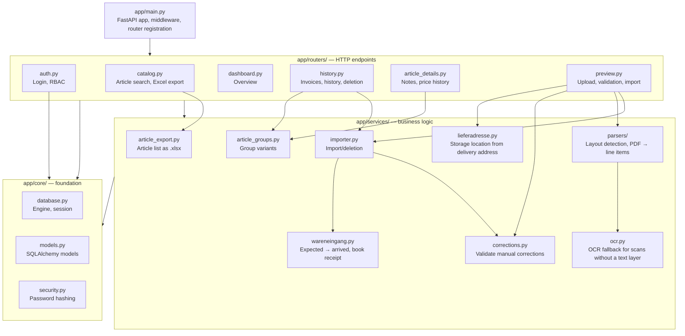
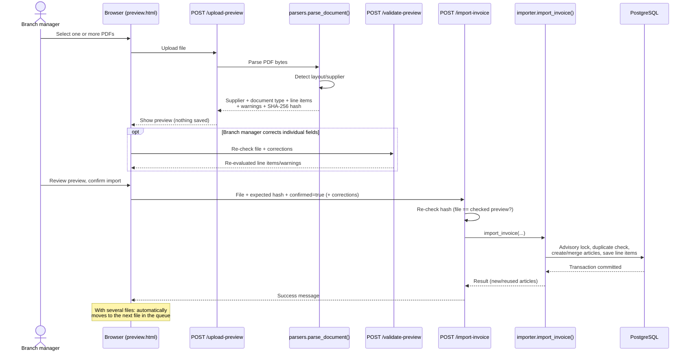

# Architecture

## Layer model

The code under `app/` is organized into three layers (see also
`README.md`):

```mermaid
flowchart TB
    main["app/main.py<br/>FastAPI app, middleware, router registration"]
    subgraph routers["app/routers/ — HTTP endpoints"]
        auth["auth.py<br/>Login, RBAC"]
        catalog["catalog.py<br/>Article search, Excel export"]
        dashboard["dashboard.py<br/>Overview"]
        history["history.py<br/>Invoices, history, deletion"]
        article_details["article_details.py<br/>Notes, price history"]
        preview["preview.py<br/>Upload, validation, import"]
    end
    subgraph services["app/services/ — business logic"]
        importer["importer.py<br/>Import/deletion"]
        lieferadresse["lieferadresse.py<br/>Storage location from delivery address"]
        wareneingang["wareneingang.py<br/>Expected → arrived, book receipt"]
        parser["parsers/<br/>Layout detection, PDF → line items"]
        ocr["ocr.py<br/>OCR fallback for scans without a text layer"]
        corrections["corrections.py<br/>Validate manual corrections"]
        article_groups["article_groups.py<br/>Group variants"]
        article_export["article_export.py<br/>Article list as .xlsx"]
    end
    subgraph core["app/core/ — foundation"]
        database["database.py<br/>Engine, session"]
        models["models.py<br/>SQLAlchemy models"]
        security["security.py<br/>Password hashing"]
    end

    main --> routers
    routers --> services
    routers --> core
    services --> core
    auth --> core
    preview --> importer
    preview --> parser
    preview --> corrections
    preview --> lieferadresse
    importer --> corrections
    importer --> wareneingang
    parser --> ocr
    history --> importer
    history --> article_groups
    article_details --> article_groups
    catalog --> article_export
```

Rule of thumb: HTTP endpoints belong in `routers/`, reusable business logic
with no direct HTTP dependency belongs in `services/`, and anything to do
with the database/models/security belongs in `core/`.

## Security model (login & rights)

Login runs on a signed session cookie (`SessionMiddleware`,
`itsdangerous`) that stays valid until manual logout. Four
FastAPI dependencies in `app/routers/auth.py` consistently enforce the
access rules on every endpoint:

| Dependency | For | Behavior without a valid login | Behavior without branch-manager/admin role |
|---|---|---|---|
| `require_login_page` | Pages (HTML) | Redirect to `/login?next=…` | — |
| `require_login_api` | JSON endpoints | HTTP 401 | — |
| `require_chef_page` | Pages, uploading/editing/deleting documents | Redirect to `/login?next=…` | Redirect to `/` |
| `require_chef_api` | JSON endpoints, uploading/editing/deleting documents | HTTP 401 | HTTP 403 |

(Internally the role is still called `chef` — the database value, function
names, and the CLI command `add-chef` are unchanged; only the UI shows
"Filialleiter"/"branch manager" for it. `require_chef_page`/`require_chef_api`
also let the `admin` role through, see `app/routers/auth.py`.)

Roles and their rights (rule 9):

| Role | Login | View/search | Notes | Upload/delete documents | Branch access |
|---|---|---|---|---|---|
| Employee | Till number | ✅ | may edit/delete only their own | ❌ | one or more assigned branches |
| Branch manager (`chef`) | Till number + password | ✅ | may edit/delete all | ✅ | one or more assigned branches |
| Admin/head office (`admin`) | Till number + password | ✅ | may edit/delete all | ✅ | cross-branch (all branches + "All branches") |

Passwords are hashed with PBKDF2-HMAC-SHA256 (600,000 iterations, random
salt per account) — see `app/core/security.py`. No plaintext password
exists in the database.

Further layers added later: `require_admin_page`/`require_admin_api`
(head office only: accounts, recommendations, 2026-09-25); login lockout
after 5 wrong passwords (`app/services/anmeldung.py`, S2); HTTPS through
the Caddy proxy with `SESSION_HTTPS_ONLY` making the cookie `Secure` (S1,
2026-09-28, see `SERVER-SETUP.md`); and the app-wide `phone_gate`
dependency limiting phone logins to an allowlist (see "Phone layer"
below). The "Notes" column above is historical — notes are no longer
shown in the interface since 2026-09-24 (data and API remain). Current
booking rights: "Booking rights as of 2026-09-24" below.

### Branch assignment and branch switching

Which branch(es) a user may see/operate is stored in the m:n table
`benutzer_lagerorte` (`app/core/models.py`, `app/services/lagerorte.py`) —
not in the `users` table itself, since a user (e.g. a temp worker) can be
assigned to several branches. `ist_primaer` marks the branch preselected
after login. Admin accounts have no entry and are considered cross-branch.

The currently active branch lives in the session (`active_lagerort_id`)
and is switched via `POST /api/active-lagerort` — the options for that come
from `GET /api/me` (`lagerort` = active, `lagerorte` = selectable). The UI
renders a `<select>` for this in the branch pill on the right of the header
(`app/static/js/session.js`), visible as soon as more than one branch is
available or the user is an admin (in which case there's also "All
branches", i.e. no active storage location). Server-side, every switch
checks that the target branch is actually assigned to the user (otherwise
HTTP 403). Since the new data model (phase A, item 3), goods receipts and
stock are tied to the active branch: an import books against the active
branch of the uploading account at the time of upload
(`require_active_lagerort` in `app/routers/auth.py`); without a selected
branch (only possible for admin, "All branches") the import fails with
HTTP 400. Markdown levels (18-/36-month notices per branch) only arrive in
phase D.

The `next` parameter on login (`/login?next=/artikel/...`) is checked in
the browser against a fixed whitelist of known routes
(`app/static/js/login-redirect.js`) before it is used as a redirect target
— this prevents a manipulated link from redirecting to an external site
(open redirect).

## Flow: upload and import an invoice

```mermaid
sequenceDiagram
    actor BranchManager as Branch manager
    participant UI as Browser (preview.html)
    participant Preview as POST /upload-preview
    participant Parser as parsers.parse_document()
    participant Validate as POST /validate-preview
    participant Import as POST /import-invoice
    participant Importer as importer.import_invoice()
    participant DB as PostgreSQL

    BranchManager->>UI: Select one or more PDFs
    UI->>Preview: Upload file
    Preview->>Parser: Parse PDF bytes
    Parser->>Parser: Detect layout/supplier
    Parser-->>Preview: Supplier + document type + line items<br/>+ warnings + SHA-256 hash
    Preview-->>UI: Show preview (nothing saved)
    opt Branch manager corrects individual fields
        UI->>Validate: Re-check file + corrections
        Validate-->>UI: Re-evaluated line items/warnings
    end
    BranchManager->>UI: Review preview, confirm import
    UI->>Import: File + expected hash + confirmed=true (+ corrections)
    Import->>Import: Re-check hash (file == checked preview?)
    Import->>Importer: import_invoice(...)
    Importer->>DB: Advisory lock, duplicate check,<br/>create/merge articles, save line items
    DB-->>Importer: Transaction committed
    Importer-->>Import: Result (new/reused articles)
    Import-->>UI: Success message
    Note over UI: With several files: automatically<br/>moves to the next file in the queue
```

Important safeguards in this flow: `/upload-preview` writes nothing to the
database; the import strictly requires the hash of the checked file; a
`pg_advisory_xact_lock` serializes concurrent imports/deletions across all
four PCs so that an article's `first_seen`/`last_seen` never becomes
inconsistent; on a database error, the entire transaction is rolled back
(no partial import); the import stays blocked as long as any warning is
open — this is enforced server-side, not just as a browser check.

## Expected → arrived

Rule 3 / D6: An **order confirmation** or **purchase order** only
announces goods. For these, the import creates a goods receipt with status
`erwartet` ("expected") — without a stock movement, without stock, without
a receipt date. Articles, variants, and prices are still created, so
announced goods can be found in the master data.

**Invoice** and **delivery note** accompany the goods; they book
immediately as before (`TYPEN_MIT_WARE` in `app/services/importer.py`).

Booking happens when the arrival is confirmed (`app/services/wareneingang.py`):

| Input | Effect |
|---|---|
| Quantity per line item | Receipt as a stock movement + stock (rule 2), `menge_eingetroffen` grows |
| Receipt date | set on the first receipt, can be backdated (D13) — not at all in a storage location without sales (rule 6) |

If less arrives than expected, the remaining quantity stays open and the
goods receipt stays `erwartet` (D22) — this way missing goods stay
visible; a follow-up delivery is simply confirmed again. Only once no line
item is open any more does the status change to `eingetroffen` ("arrived").

If **more** arrives than expected, the actual quantity is booked — stock
reflects what physically sits in the store — and the response reports the
affected line items in `mehrlieferungen` (line item id, expected quantity,
arrived quantity, difference). The page appends a warning note to the
success message for this. This is measured against the total for the line
item, not the individual booking: you can also exceed the expected
quantity via a follow-up delivery (confirmed 2026-09-22, phase C, subtask C1).

Two things are deliberately kept identical: import and arrival both book
through the **same** function (`buche_zugang`), and both take the same
`pg_advisory_xact_lock`, so receipts from different workstations can't
overtake each other. "First/last delivery" (`varianten.first_seen`/
`last_seen`) only count goods that have actually arrived — an announcement
is not a delivery.

This is handled on the **/wareneingaenge** page (navigation "Deliveries"):
the open deliveries for the active branch, per line item expected /
already here / open, and a field for the quantity that has now arrived.
**Employees** are allowed to do this too (D21) — confirming arrival is
warehouse work, not a document right.

## Viewing stock

`app/services/bestand.py` reads what `lagerbewegungen` has booked — it
writes nothing (rule 2). A row is a **variant × storage location** with
quantity and the oldest receipt date; the same query returns the count and
total quantity for the whole selection, so the page doesn't have to
calculate it.

Three things are deliberately built this way:

- **All branches are readable** (confirmed 2026-09-22). The active branch
  is preselected, but all locations are selectable — the branch switcher
  in the session bar is unaffected by this and still decides where
  bookings go.
- **Rows with quantity 0** don't show up (without a toggle since
  2026-09-24; the API still knows `nur_vorhanden`), but nothing is
  deleted: sold-out goods stay in the master data. Color, size, and main
  group have their own columns. A **negative** stock, on the other hand,
  is always shown — it's possible (confirmed 2026-09-22) and exactly then
  interesting.
- **Goods at a location without sales** (GEWA, VEBO, Dietikon) have no
  receipt date (rule 6/D13). The page doesn't show an empty dash for
  that; it explains why: the date is set once the goods arrive at a
  branch.

Page: **/bestand** (navigation "Stock"), filters for branch, search, and
"only rows with stock", loads more via `offset` (phase C, subtask C2).
For now, every row has a "−1" button for testing the write-off flow (see
next section).

## Writing off

Manual sale or removal (`app/services/ausbuchung.py`, page `/ausbuchen`,
phase C, subtask C3). The counterpart to a receipt: the same lock, the
same rule 2 — every change is a row in `lagerbewegungen`, and stock is
updated in the same step.

- **One scan = one piece** (F15, 2026-09-23). The page collects quick
  scans and books them in order; the field is immediately free again
  after each scan.
- **Reasons** (F14): `verkauf` ("sale") is booked as `typ = verkauf`, all
  others (`defekt`/"defective", `diebstahl`/"theft",
  `eigenbedarf`/"own use", `retoure`/"return",
  `sonstiges: <text>`/"other: <text>") as `ausbuchung` ("write-off"). This
  keeps sales separable from shrinkage.
- **Insufficient stock** (F9): warn, but book anyway. A removal never
  changes the receipt date.
- **Undo**: an offsetting `korrektur` ("correction") booking with
  `grund = 'storno:<id>'`, at most once per write-off — nothing is
  deleted.
- Variants **without an EAN** (rule 5) can't be scanned; they are written
  off via their variant id, currently through the temporary "−1" button
  in the stock view (`grund = 'test'`).

## Transferring stock

Goods from one storage location to another
(`app/services/umlagerung.py`, page `/umlagern`, phase C, subtask C4).
Booking happens **on receipt by the receiving branch** (F5): one
transaction writes two rows per variant with `typ = umlagerung` — a
removal at the source, a receipt at the destination.

Which date rule applies is decided solely by `lagerorte.verkauf`:

| From → to | Receipt date / clock at the destination |
|---|---|
| external → branch | is set (backdated if desired), clock starts (D13) |
| branch → branch, destination already knows the article | goods keep their date (D17), destination's clock keeps running (F10) |
| branch → branch, destination never had the article | clock starts on arrival (F11) |
| anything → external | no date, no clock (rule 6) |

If a transfer starts the clock, the date sits on its destination row in
`lagerbewegungen.eingangsdatum`; `reduktion.letzter_wareneingang()` takes
the later date out of goods receipts and these transfers. Insufficient
stock at the source is reported but still booked.

## Correcting

Bring stock to the counted quantity (`app/services/korrektur.py`, "Count"
button per row in `/bestand`, phase C, subtask C5). What's entered is
what's actually on the shelf; the server calculates the difference under
the same lock as any receipt and books it as `typ = korrektur`. If the
stock already matches, nothing is booked. Reasons: stocktake/count,
mis-booked, goods found, other (with text). The receipt date never
changes.

## Overview

`app/services/uebersicht.py` supplies `GET /api/dashboard` with, besides
the master figures, the metrics for the **active branch** (pieces in
stock, sold/removed today), "Upcoming" (expected deliveries, negative
stock, markdown age per level incl. a 30-day preview, articles without a
category or EAN), and "Recent" (requirement 8): deliveries as a whole
delivery (goods receipt per day), transfers as one entry, removals other
than sales individually; sales, corrections, and receipts without a goods
receipt don't appear. Markdown age is calculated in one query for all
articles — the same rule as `reduktion.letzter_wareneingang()` (goods
receipt or transfer with a receipt date). Without an active branch,
`filiale` stays empty.

## Deleting an article

Only for manually entered articles **without a document**, and only for
branch managers and head office (`app/services/artikel_loeschen.py`,
decision of 2026-09-24). Removes, in one transaction under the booking
lock: stock movements, stock, manual goods-receipt line items (and manual
goods receipts left empty by that), prices, notes, variants, and the
article; the operation is written to the server log.

## Entering goods manually

The second way goods enter the system: **without a PDF, without a parser**
(`app/services/manuelle_erfassung.py`, page `/erfassen`). Meant for goods
without a document and for suppliers whose layout no parser knows yet.

D27: goods without a document are a **direct goods receipt without a
document** — no entry is created in `dokumente`,
`wareneingaenge.dokument_id` stays empty (migration `a7b8c9d0e1f2`, which
also adds `artikel.lieferant_id`). Booking happens immediately (rule 3:
only what you're physically holding gets manually entered), through the
**same** `buche_zugang()` and the same lock as import and arrival
confirmation.

| Field | Required? | Note |
|---|---|---|
| Brand, description, quantity, RRP | yes (D23) | nothing more is required |
| EAN | no (rule 5) | a known EAN fills in the form; an unknown one is accepted |
| Color, size | no | together with the item number, the key when there's no EAN |
| Unit, supplier item number, purchase price | no | purchase price only saved if present (rule 10) |
| Supplier | no | applies to the whole goods receipt, not per line item |
| Receipt date | no | today or backdated (D13); a storage location without sales gets none (rule 6) |

Articles and variants are looked up via `app/services/artikel.py` — by
exactly the same rule as on import: known EAN → known variant, otherwise
supplier + item number + color + size. This module exists so the two
paths don't drift apart. Without a supplier, the search is among articles
without a supplier; so an article "Nike A1" with a supplier and one
without stay separate.

Flow in the UI (built for a scanner): scan barcode → form is filled in →
type quantity → Enter adds the line item to a list → next article. Only
**one** button at the end books all line items as a single goods receipt,
in one transaction: all or nothing. Validation happens server-side; the
browser only pre-checks, so feedback is instant.

**Employees** may also enter goods this way (rule 9/D21) — no document is
created, so the document right doesn't apply. The destination storage
location goes through the same server-side check as import
(`resolve_wareneingang_lagerort`, D26), so it can be booked to any storage
location, with the active branch preselected. Each line item also leaves
an unmodified snapshot of the input in
`wareneingang_positionen_quelle` (with user and timestamp), and the stock
movement gets the reason `manuelle-erfassung` — a fixed key, not UI text.

## Internal EAN and label

Rule 5/D10: the EAN is optional; many suppliers don't provide one. So
such an article can still be scanned at the till, the system generates,
on request (D24), an **internal EAN-13 in the GS1 range 20-29**
(`app/services/ean.py`). Structure: `20` + a ten-digit variant id +
check digit. This needs no counter, is always the same number for the
same variant, and carries its origin within it; `varianten.ean_intern`
flags it.

Two rules for this:

* An **existing EAN is never overwritten** — the item master stays intact
  (rule 4), and a printed number is already stuck on the goods.
* A **manually added-later** EAN is strictly checked, both format *and*
  check digit. On import, this is deliberately just a format check
  (subtask B3): there the number is exactly as printed in the supplier's
  document, whereas here someone types it, and a transposed digit would
  stay in the master data forever.

The **label** (D25) comes as a PDF sized to the label, so the Sato CL4NX
Plus (D14) prints it 1:1 — one page per label, `anzahl` repeats it. It
shows year, supplier, RRP, and markdown level, plus brand, description,
color/size, and the **EAN barcode**: without it, exactly the article the
internal EAN was made for would stay unscannable.

| Field | Source |
|---|---|
| Year | year of the last goods receipt of this article **at this branch** (rule 6) |
| Supplier | `artikel.lieferant_id`, empty for manually entered goods (D23) |
| RRP | most recent entry in the variant's price history |
| Markdown | suggestion per rule 6 (18 months → 50%, 36 → 70%), overridable — the 30% from D25 is a store decision, not a time-based rule |
| Barcode | EAN-13/EAN-8, UPC-12 as EAN-13 with a leading zero |

Drawn with PyMuPDF (already in use for reading invoices anyway) and the
fonts embedded in the PDF — no extra dependency, no internet, no font
installation on the printer (rule 1). The barcode pattern is calculated
by `app/services/barcode.py` itself; an EAN-14 (outer carton) is ITF-14
and is therefore only printed as a number, as is a number with an
incorrect check digit — better no barcode than one the till won't accept.

**Label (new as of 2026-09-24):** pre-printed rolls in the Sato CL4NX
Plus, 47 × 83 mm tall, with logo, percent dot, and mountains — one roll
per markdown level (30% yellow, 50% red, 70% green, `ROLLEN`). Only the
RRP is printed (struck through), on the left the supplier-group code
(111/555/333/999/444, from `lieferanten.typ`), on the right the two-digit
year, and under the mountains the barcode. All positions are in `LAYOUT`
(millimeters), since the roll is currently being redesigned; `muster=True`
also draws the pre-print for the preview. The barcode's module width is
capped so it isn't stretched excessively wide on large labels.

This is handled in two places: on the **article page** (view, generate,
add-later EAN, print label) and directly after **manual entry** — there,
one button prints the labels for the whole goods receipt, one label per
piece. Both are also allowed for **employees** (rule 9): it's warehouse
work, not a document.

## POS category: suggestion and manual choice

Every article carries a POS category: main group × sport area, exactly as
in the till (rule 8). It reaches the article in two ways, and the order
matters.

**Suggestion from the FEDAS code.** INTERSPORT invoices carry a 6-digit
FEDAS code per line item; `app/core/fedas.py` translates the first digit
into the main group and digits 2–3 (activity area) into the sport area;
whole bicycles (product groups 16001–16008) become "bike", sports
nutrition (10020) becomes "food". Fabian confirmed the mapping of all 54
FEDAS activity areas on 2026-09-24; the list itself is not in the repo.
"Kids" cannot be derived from FEDAS.

**Manual choice** (`app/services/kategorien.py`) for everything else,
which is the normal case: most suppliers don't provide a FEDAS code,
manually entered goods have no document at all (D27), and "Kids" can't be
derived from FEDAS. Chosen on the article page or right when entering
goods; open articles are found via the "No category" filter in article
search.

One single rule applies between the two paths: **never overwritten.** The
import only fills an empty category ("once per article, remembered after
that"); a manual choice may, conversely, correct a wrong suggestion and
then stays in place — even if an invoice with a known code arrives later.
`artikel.kategorie_manuell` records where the value came from, and the UI
states it too: a piece of information worth knowing between "suggested"
and "confirmed by someone." If the category is cleared, the article is
open again and a later document may suggest one again.

The category belongs to the **article**, not the variant: it applies
across all branches for all colors and sizes of the same model (rule 4).
It's still addressed via the variant id, like notes and prices — that's
the id clicked in the article list. **Employees** may also maintain it
(rule 9/D21): the item master isn't a document.

## Storage location from the delivery address

Where a goods receipt gets booked is on the document: the external
distributor sends the invoice to Volketswil and the goods to Conthey, CMP
delivers to GEWA. `app/services/lieferadresse.py` reads this from the
document text — pure text logic, without a database and without layout
knowledge, so it works the same for every supplier. The addresses come in
as values (`lagerorte.lade_adressen()`), not as ORM objects.

| Feature | Points | Why |
|---|---|---|
| Postal code | 3 | unique per place, short, survives OCR best |
| Place name | 2 | confirms the postal code, often appears even without it |
| Storage-location name (e.g. "GEWA", "VEBO") | 2 | on the CMP order confirmation only "GEWA" appears as the destination. Only *distinguishing* words count: "Lager Dietikon" ("Warehouse Dietikon") doesn't score a keyword hit, otherwise any document with the word "Lager" ("warehouse") would match — there the place name carries it |
| Street name | 1 | too weak alone — "Industriestrasse" matches both SF1 *and* SF4 |

The search runs in two passes: first around a delivery-address anchor
("Lieferadresse", "Lieferanschrift", "Lieferung an", "Warenempfänger",
"Adresse de livraison", "Ship to" …), otherwise across the whole text. Two
safeguards against wrong suggestions: a **minimum score** (a street alone
is never enough) and **no suggestion on a tie** — if the invoice address
and delivery address are equally represented in the text, any choice
would be a guess. Umlauts are matched in both spellings ("Hägendorf" and
"Haegendorf").

**The suggestion decides nothing** (D19). `/upload-preview` returns it
along with the selection list and the active branch; the preview shows
"Book goods receipt to" with a reason; `/import-invoice` takes the chosen
storage location as a form field and validates it server-side
(`resolve_wareneingang_lagerort` in `app/routers/auth.py`). If the UI
sends nothing, it stays with the active branch — as before.

**All** storage locations can be booked to, with the user's own branch
first (`list_wareneingang_lagerorte`). Otherwise a delivery to another
branch or to an external location couldn't be recorded at all, and D19
would be pointless for exactly the cases it's meant for. Branch switching
is unaffected and stays limited to assigned branches; employees and
branch managers may read all branches (confirmed 2026-09-22,
`docs/projekt-kontext.md` section 10). A document has exactly one storage
location (D20); goods are distributed afterward via a transfer.

## Detecting duplicate imports

Two rules, both enforced server-side:

| Feature | Scope | Why |
|---|---|---|
| `dokumente.datei_hash` (SHA-256) | **globally** unique | the same file is the same document, no matter who uploaded it |
| `dokumente.dokumentnummer` | unique **per supplier** (`UNIQUE (lieferant_id, dokumentnummer)`) | document numbers are a supplier matter and can freely overlap |

The importer checks both itself (with an understandable message "Invoice
… was already imported") and, for this, looks up the supplier **before**
the duplicate check; the database constraints are the fallback in case
two imports run at the same time. Accordingly, `GET
/invoice-import-status` needs the `parser_key` from the preview response
in addition to the document number — without a supplier, only the file
hash counts (migration `e5f6a7b8c9d0`, phase B subtask B2).

## Corrections in the preview

If the parser reads a line item incorrectly or incompletely (e.g. color
and size not cleanly separated, EAN missing), the branch manager can
correct the affected field directly in the preview table instead of
rejecting the whole invoice. `app/services/corrections.py` applies these
corrections server-side to the freshly parsed data (never to raw data
sent from the client) and fully re-validates every line item: required
fields, EAN format (8/12/13/14 digits **if an EAN is entered** — color,
size, and EAN are optional, rule 5), numeric format for quantity/RRP.
So deleting an EAN is allowed and produces a hint; entering nonsense
remains an error. Every actual change is stored as a `correction_audit`
(original value, new value, who, when) in
`wareneingang_positionen_quelle` — traceable even after the invoice has
been imported. `/validate-preview` lets a correction be re-checked before
the actual import; `/import-invoice` applies the same validation again
server-side before anything is saved.

## Batch import (several invoices in sequence)

The upload page accepts several PDFs at once. Each file gets its own
queue entry with a status (waiting, ready, duplicate, error, imported);
the browser automatically checks new files via
`/invoice-import-status` for already-imported duplicates before adding
them to the queue, and automatically jumps to the next open file after
each successful import. "Duplicate" here means: the same file (SHA-256)
or the same document number **for the same supplier** — two suppliers may
use the same number (see "Detecting duplicate imports" below).
Corrections on one file are completely isolated from the other files in
the queue. There's no separate "batch" endpoint server-side: each file
goes individually through the same preview/validation/import flow as a
single upload — the queue is pure frontend logic
(`app/static/js/preview.js`).

## Article grouping, notes, and price history

Different colors/sizes of an article have different EANs and therefore
different `varianten` records. Since the new data model (phase A, item 3,
see `datenmodell.md`), grouping is a real foreign-key relationship: all
variants of a model share the same `artikel_id`.
`app/services/article_groups.py` now only reads this relationship instead
of reconstructing it at runtime from brand + supplier item number — the
grouping rule itself (same brand **and** the same, non-empty supplier
item number; if missing, the article stays on its own) is unchanged and
is now applied at import time (`app/services/importer.py`). This way the
article detail page (`/articles/{id}/history`) automatically shows the
delivery history, price history, and notes of all variants of an article
in one place, without anyone having to maintain the grouping manually.

Notes (`article_notes`, see `datenmodell.md`) are free text on an article
group, e.g. observations about sales or hints for the next order.
Editing/deleting requires the last-read `version` (optimistic locking): if
someone else has changed the note in the meantime, the request fails with
HTTP 409 instead of silently overwriting the other person's change.
Employees may only edit/delete their own notes; branch managers and
admin/head office may edit/delete all (`_may_edit_any_note()` in
`app/routers/article_details.py`).

## Article list as an Excel export

`/api/articles/export` returns the same filtered/sorted article list as
`/api/articles`, but without pagination and as a fully formatted `.xlsx`
file (`app/services/article_export.py`, via `openpyxl`): bold header row,
sensible column widths, number/date formats, frozen header row, and
auto-filter. Meant for sharing/printing outside the app, e.g. for an
order list.

## Flow: deleting an invoice

Only branch managers and admin/head office (`require_chef_api`).
`delete_invoice()` runs under the same advisory lock as the import,
removes the invoice along with its line items and original snapshots, and
afterward recalculates `first_seen`/`last_seen` of the affected articles
from the remaining deliveries, instead of leaving stale values in place.

## PDF parsing: one module per supplier layout

Every supplier layout lives as its own module in
`app/services/parsers/` and implements the same interface. `__init__.py`
is the **registry** that decides who's responsible:

| Component | Role |
|---|---|
| `base.py` | `read_document()` reads the whole PDF **once** (words with coordinates per page, via OCR for pages without a text layer), plus the recurring building blocks `lines()`, `joined()`, `decimal_value()` |
| `<supplier>.py` | `KEY` (= `lieferanten.parser_key`), `LIEFERANT_NAME`, `detect(doc)`, `parse(doc, lang)`, `dates(doc, lang)` |
| `__init__.py` | `PARSERS` list, `detect_parser()`, `parse_document()`, `UnknownLayoutError` |

**Registered layouts (2026-09-24):**

| Module | Supplier | Documents | Special cases |
|---|---|---|---|
| `intersport.py` | INTERSPORT Schweiz AG | Invoice | FEDAS code; reference "ret.Ecom" → supplier ECOM (code 555); "Preis" column = purchase price |
| `alpina.py` | ALPINA SPORTS Schweiz AG | Order confirmation | no EAN; article = model (first 5 characters of the product number), color and size from the description; quantity × unit price = line total checked |
| `chrissports.py` | CHRIS sports AG | Order confirmation | "Preis" = RRP (D12), purchase price = amount/quantity; brand without a segment ("Giro"); "Total Menge" checked |
| `cmp.py` | CMP (F.lli Campagnolo S.p.A.) | Order confirmation | size grid, values assigned by the right edge of the size column; cancelled blocks skipped; each block total checked |

The newer modules have their line items validated uniformly by
`base.pruefe_position()` (required fields, EAN, numbers) and build the
result with `base.ergebnis()`. Tests: `tests/test_parser.py` with sample
documents from `BELEGE_DIR` (local only, never in the repo). Deliberately
**no** parser: the Bollé invoice (FaGu) only states the purchase price,
no RRP.

**Detection** (`detect()`): every module scores the document or rejects
it (`None`); the highest score wins. On a tie, detection aborts with a
clear message instead of guessing a supplier. For the INTERSPORT layout,
the line-item table with its header row is the required feature (on a
scan, the company logo isn't always readable as text, but the table is);
company name and invoice number only add to the score. If **no** module
matches, the upload reports "document layout not yet known" — without AI
(rule 1) a never-seen layout can't be read automatically; the document
has to be handed over as a sample (projekt-kontext.md section 6, item 1).

**Reading** (`parse()`, here `intersport.py`): reads the invoice table via
word coordinates from PyMuPDF (no layout template, no fixed column
widths): the header row is found via known column titles, rows are
grouped by their vertical position, continuation lines of a line item
(e.g. a multi-line description, color/size in parentheses) are attached
to the previous line item. The parser itself writes nothing to the
database and makes no automatic assumptions when things are unclear. If a
single page of a recognized layout deviates (e.g. header row unreadable
on a scan), that leads to an explicit error instead of silent
misbehavior.

**Warning or hint?** Every line item carries two separate lists:

| List | Meaning | Import |
|---|---|---|
| `warnings` | something was read uncertainly or implausibly (required field empty, color/size not clearly separated, unreadable EAN, unassignable line) | **blocked** until checked or corrected |
| `hints` | everything is fine but should stand out — currently: a line item **without** an EAN (rule 5) | goes through |

The preview shows hints, muted, under the warnings for the same line item
and counts them as their own metric (`rows_with_hints`). An EAN that's on
the document but doesn't have a valid format stays deliberately a
warning: that's a suspected reading error, not a deliberately missing
number (subtask B3).

**Document type** (D6): `parse()` returns it too (`rechnung`/"invoice",
`lieferschein`/"delivery note", `auftragsbestaetigung`/"order
confirmation", `bestellung`/"purchase order") — it ends up in
`dokumente.typ` and later decides whether a goods receipt is only
*expected* or books stock (rule 3). So far the INTERSPORT layout only
appears as an invoice and detects the type via the anchor "Rechnung Nr.";
without this anchor, the type stays open and the import rejects the
document.

**Read once:** detection, line items, and the invoice/document date all
work on the same parsed `Document` (see `importer.import_invoice()`).
Previously, the import opened the file a second time for the date
fields and ran a scan through text recognition twice.

A new layout (roadmap phase E) therefore needs exactly two steps: create
a module with the interface and register it in `PARSERS`. The matching
supplier must have the same `parser_key` in the seed data
(`app/core/lieferanten.py`) — `tests/test_parser.py` checks that.

## OCR fallback for scanned paper invoices

Very rarely, an invoice doesn't arrive digitally by mail but only on
paper in a package. A scan of that is a PDF without a text layer (a pure
raster image per page) and would immediately fail normal parsing with
"layout not recognized". `parsers/base.py` (`read_page()`) therefore
first checks `page.get_text("words")` per page; if that returns nothing,
`app/services/ocr.py` takes over the page:

1. Render the page with PyMuPDF as an image (300 DPI); Tesseract's
   orientation detection (OSD) corrects any remaining wrong rotation, if
   the scan hasn't already recorded it in the PDF itself.
2. Tesseract reads words with positions from the image.
3. The pixel coordinates are converted to PDF points and normalized to a
   common height per detected line of text, so the result looks exactly
   like PyMuPDF's own `words` list — both the layout detection and the
   table detection in the parser modules (header search, column
   boundaries, row grouping) then run unchanged afterward, regardless of
   whether the words came from the text layer or from OCR.

OCR pages and the line items read from them are flagged with `ocr_used`
(all the way into the database, `Dokument.ocr_verwendet`); the preview
shows a dedicated hint for this recommending extra-careful review, but
this flag alone doesn't block the import — only genuine data problems
(missing required fields, ambiguous color/size, etc.) do, exactly as with
digitally received invoices. If Tesseract isn't installed on the machine,
the upload reports a clear error instead of a silent failure (see
`README.md` for local setup; Tesseract is already included in the Docker
image).

## Frontend: no framework, but a shared theme

`app/static/js/` deliberately stays without a build pipeline (see
decision E8), but two scripts are included across all pages:

- `theme.js` manages light/dark mode via CSS custom properties in
  `app.css` (follows the system setting by default, can be switched
  manually, remembered via `localStorage`) and provides the toggle
  button as a factory function.
- `nav.js` builds the main navigation in **one** place (the templates
  only contain an empty `<nav>`): Overview, Stock, "Goods" group (Enter,
  Deliveries, Transfer, Write off), Articles, "Documents" group (All
  documents, Upload document). The groups expand with a short
  explanation per entry; the active page carries `aria-current="page"`.
  "Upload document" is only visible to branch managers and head office
  (rule 9). Below 900 px width, everything sits behind the "Menu"
  button.
- `session.js` builds the right side of the header: the **branch pill**
  (active branch, a select if several are available) and the **account
  menu** behind the initials button (name, till number, role, language,
  light/dark, Excel export on the article page, log out). It fires the
  login as a `sportfabrik:me` event so `nav.js` can filter by role, and
  hides the upload tile on the overview for employees.

For older or visually impaired staff, article search additionally offers
a column picker (hide individual columns) and larger text in the results
table, also remembered via `localStorage`.

### Design: one token set for all pages

`app/static/css/app.css` is the single source of styling (no inline
styles in the templates, no external CDNs — rule 1). It's organized into
numbered sections; colors, spacing, radii, shadows, and transitions exist
exclusively as custom properties on `:root`. The full design system
(mission, rules, component specs, migration plan) lives in
[DESIGN.md](../DESIGN.md), implemented across all pages 2026-09-27
(see the "UI redesign after DESIGN.md" addendum in `docs/projekt-kontext.md`
for what changed and how it was verified); this section gives the
current token/component shape, not the history.

- **Colors/surfaces**: `--bg`, `--surface`, `--surface-soft`,
  `--surface-alt`, `--text`, `--text-muted`, `--text-faint`, `--border`,
  `--border-strong`, `--accent` (Sportfabrik orange), status colors
  `--danger-*`/`--warning-*`/`--info-*`/`--success-*`, and
  reduction-stage tokens (30/50/70%, coupled to the roles in
  `etikett.py`).
- **Shape**: 3 radius steps (`--radius-sm/md/lg`) plus `--radius-pill`
  for buttons, `--shadow-sm/md/lg` for elevation steps (panels sit at
  elevation 0, no shadow).
- **Spacing/type**: a 4px spacing scale and a 9-step type scale
  (`--fs-*`); every raw font size in the CSS is mapped to one of these
  tokens.
- **Motion**: `--ease`, `--fast`, `--slow`; a block under
  `@media (prefers-reduced-motion: reduce)` turns off all transitions.
- **Grid**: `--page-pad` and `--content-max` (1280 px, 1680 px on wide
  pages). Header and footer calculate their inner padding from
  `--content-max`, so navigation, content, and footer sit on the same
  edge.
- **Icons**: a single sprite (`app/static/img/icons.svg`, 27 icons)
  replaces all Unicode symbols previously used in CSS/JS.
- **Reusable components**: button variants (primary/secondary/ghost/
  danger/loading), form fields (44px, 16px font against iOS zoom,
  helper/error pattern), `.chip-stage` (yellow/red/green markdown-stage
  chip), `.empty-state` (icon + sentence, centered), `.is-loading`
  (spinner before the label, `currentColor`, label stays visible), and
  a scan-field variant (`--icon-scan`, 52px, barcode icon left) for the
  three real scanner inputs (write off/enter/transfer `#ean`).

Dark mode redefines **only** these tokens (twice: once for
`prefers-color-scheme: dark`, once for the manual choice
`:root[data-theme="dark"]`) — not a single component has its own dark-mode
rules. Anyone who wants to change a color changes it in exactly one
place. `color-scheme` is set as well, so native controls (date fields,
scrollbars) match the mode too.

Since 2026-09-23 the header has been **single-line** and stays fixed
while scrolling (`sticky` with `backdrop-filter`): the brand on the left,
next to it the navigation from `nav.js`, and on the right the branch pill
and account menu from `session.js`. Expandable menus are controlled via
the `is-open` class, not `hidden` — the global rule
`[hidden] { display: none !important }` couldn't otherwise be overridden
on narrow screens. If the file changes, the cache parameter (`?v=…`) in
the templates has to be bumped along with it — otherwise branch
computers still see the old version.

## Error handling

Consistent principle: fail explicitly with a clear message translated
into the account's language (see "Multilingualism (i18n)" below) rather
than make an assumption that later turns out wrong. Examples: unknown
invoice layout, password-protected PDFs, files that are too large
(> 20 MB), ambiguous color/size information, an invoice/document date
that can't be uniquely detected, conflicting correction values,
simultaneously edited notes (HTTP 409). Database errors during an import
or a deletion lead to a full rollback of the transaction (never a partial
import).

## Multilingualism (i18n)

Rule 7: German is the default, DE/FR/EN are fully supported, no
hardcoded UI text or error messages (templates, JS **and** backend).

**Catalog.** The single source is three flat JSON files
`app/static/i18n/{de,fr,en}.json` (key → translated text, `{placeholder}`
via `str.format`). They're directly available at
`/static/i18n/<language>.json` (for the frontend) and are read by the
backend via `app/core/i18n.py` (`translate(key, language, **params)`,
`template()` for the unformatted text, `normalize_language()`). A
missing key falls back to German, then to the key itself (this makes a
forgotten catalog entry immediately visible instead of throwing a cryptic
error).

**Per-request language detection** (`app/routers/auth.py`): when logged
in, the account's language (`users.language`, via
`Depends(get_language)` — reuses the user already loaded by
`require_login_api`, no extra DB query); anonymous (e.g. `/login`) the
`Accept-Language` header (`get_language_optional`), otherwise German. All
routers that raise errors attach `language: str = Depends(get_language)`
and translate every `HTTPException` message with
`translate(key, language, ...)`. This also applies to the service layer
(`parsers/`, `ocr.py`, `corrections.py`, `importer.py`): `language` is
passed through from the routers all the way to `parse_document()`,
`apply_corrections()`, `import_invoice()`, `delete_invoice()`, so that
parser warnings (shown in the preview) and correction error messages are
translated too. One special case: when re-validating,
`corrections.py` has to recognize old parser warnings
language-independently (e.g. "Pflichtfeld fehlt: …" vs. "Required field
missing: …") — for this, `template()` returns the unformatted template,
whose fixed part before the first `{` serves as a prefix.

**Frontend** (`app/static/js/i18n.js`, IIFE, exposes
`window.SportfabrikI18n`): loads the catalog of the last chosen language
at startup (`localStorage` key `sportfabrikLanguage`, set before login)
and applies it to all elements with `data-i18n`/`data-i18n-placeholder`/
`data-i18n-aria-label`/`data-i18n-title` (`textContent` or the respective
attribute). The German text still sits directly in the HTML (a fallback
before the first catalog fetch, matching German as the default).
Text created dynamically by JavaScript uses
`window.SportfabrikI18n.t(key, vars)`; after a language switch, a
`sportfabrik:i18n-ready` event fires, which every page with dynamic
content listens for in order to re-render (e.g. `load()` in
`history.html`/`articles.html`, `renderQueue()`/`render()` in
`preview.js`). `session.js` reconciles the account language from
`/api/me` with `localStorage` after login (`syncFromAccount`, no repeat
`POST`); the language switcher in the settings menu or on the login page
calls `setLanguage()`, which reloads the catalog **and** (when logged in)
calls `POST /api/language`.

**What is (deliberately) not translated:** article data from supplier
documents (rule 7), fixed text anchors in the INTERSPORT layout that the
parser uses to search the PDF (e.g. "Rechnungsdatum"/"Belegdatum" — the
PDF is always German, regardless of the UI language), Pydantic field
validation errors (e.g. an empty note) — whose JSON form (`detail` as a
list instead of a string) the frontend never displays directly anyway,
replacing it with a generic translated message —, and the column headers
in the Excel export (`article_export.py`, its own document format, still
open).

## Booking rights as of 2026-09-24

Employees may manually book in goods and correct stock, but only in their
assigned branches. Writing off a sale/removal, cancelling, and
transferring are reserved for branch managers and head office. Their
existing cross-branch booking rights remain in place; read rights are
unchanged.

`/ausbuchen`, `/api/ausbuchen/stammdaten`, `POST /api/ausbuchen`,
`POST /api/ausbuchen/{id}/storno` as well as `/umlagern` and all
`/api/umlagerung` endpoints require branch manager/head office. The
write-off list (`GET /api/ausbuchungen`) stays readable for everyone.
`GET /api/erfassen/stammdaten` offers employees only their assigned
branches; entry/correction also check this boundary server-side.
`GET /api/bestand` additionally returns `rechte.ausbuchen` and
`rechte.korrektur_lagerorte`, which determine which actions are shown.

## Phone layer (implemented 2026-09-28)

A login from a phone is flagged in the session. `app/core/handy.py` holds
the allowlist and the server-side check; every route (page and API) is
checked against it. A blocked API call returns a translated 403, a
blocked page redirects to `/m`. The flag survives "Request desktop
site"; roles and branch limits from the sections above apply unchanged,
and tablets keep the desktop version.

`app/routers/handy.py` serves the phone-only pages under `/m/*`:
- `/m`, `/m/suche` — home screen and article search/detail
- `/m/zaehlen` — count and correct stock
- `/m/lieferungen` — confirm goods arrival
- `/m/umlagern` — transfer (branch manager/head office only)
- `/m/ausbuchen` — write off a sale/removal (branch manager/head office only)
- `/m/erfassen` — manual goods entry
- `/m/runterschreiben` — mark-downs and manual reduction

These pages call the existing desktop APIs (`bestand`, `wareneingaenge`,
`umlagerung`, `ausbuchen`, `erfassen`, `reduktion`) rather than adding a
parallel API surface; only the phone layer and templates are new.
Camera scanning uses the browser's native barcode reader where available
and a bundled ZXing library otherwise (no CDN, per rule 1); a code counts
only after two identical reads with a valid check digit. Full feature
list and decisions: `docs/projekt-kontext.md`, "Mobile phone use –
implemented 2026-09-28"; original requirements: `docs/handynutzung.md`.
